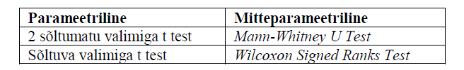

```{r, echo = F, message=F, warning=F}
load("KMKT/3praktikum/ttest_andmed.RData")
```

Selle praktikumi eesmärkideks on läbi teha järgmised tegevused:  
(1) kahe sõltumatu grupi keskmiste võrdlemine parameetrilise ja mitteparameetrilise testiga (t test),  
(2) kahe sõltuva grupi keskmiste võrdlemine parameetrilise ja mitteparameetrilise testiga,  

(3) rohkem kui kahe grupiga keskmiste võrdlemine parameetrilise (ANOVA) ja mitteparameetrilise (Kurskal-Wallis) testiga.  

## Kordamine  
Laadige andmestik **test11.csv** RStudiosse.    
**Ülesanne 1.** Leidke meeste ja naiste keskmised teksti mõistmise ja matemaatika ülesannetes (1 = M, 2 = N).   
**NB!** Kasutage subset() funktsiooni ainult ühe kategooria andmete valimiseks. Esimene argument on meid huvitav tunnus, teise argumendiga määrame kategooria väärtuse: 
```{r, eval = F}
#subset(tunnus, kategooria == väärtus) # topelt võrdusmärk tähedab, otsime täpselt antud väärtusega andmeid
subset(test11$tekst, test11$Sugu == 1)# see annab meile teksti mõistmise tulemused kategooria 1 kohta ehk meeste teksti mõistmise tulemsued.
subset(test11$tekst, test11$Sugu == 2)# see annab meile teksti mõistmise tulemused kategooria 2 kohta ehk naiste teksti mõistmise tulemsued.
```

```{r, eval = F, echo = F}
mean(subset(test11$tekst, test11$Sugu == 1))
```

## T-testi eeldused  
Tuletame meelde t-testi eeldused:  
1.Andmed on vähemalt intervall skaalal.    
1.1 Sõltuvate rühmade t-testi puhul peab olema normaaljaotusega jaotus, mis on moodustatud järgmiselt: ühel korral mõõdetud tulemustest on lahutatud teisel korral mõõdetud tulemused.   
1.2 Sõltumatu t-testi puhul peab tunnus rühmade lõikes olema normaaljaotusega, samuti peavad rühmade dispersioonide olema homogeensed (ning valimid peavad olema sõltumatud).  
  
Selle praktikumi jooksul me ei jõu kahjuks iga ülesande puhul eeldusi kontrollida. Toon siia t-testi eelduste kontrolli, mida tuleks teha ülesande 2 puhul. Selles ülesandes vaatame teksti mõistmise tulemusi sugude lõikes.   

### Kas uuritav tunnus on rühmade lõikes normaaljaotusega?   
Shapiro Wilki test üks levinumaid statistilisi meetodeid normaaljaotuse kontrollimiseks. 
Väljundist tuleb vaadata *p-value*-t. Kui *p-value* on väiksem kui 0.05, siis ei ole andmed selle testi kohaselt normaaljaotuslikud.
```{r}
# Kontrollime meest(1) puhul tunnuse "tekst" normaaljaotust:
shapiro.test(subset(test11$tekst, test11$Sugu == 1))
# Kontrollime naiste(2) puhul tunnuse "tekst" normaaljaotust:
shapiro.test(subset(test11$tekst, test11$Sugu == 2))
```

Praktikas on omajagu harv normaaljaotustestide põhjal leida normaaljaotuslikkust – levinud on asümmeetriakordaja (*skewness*) ning ekstsessi (*kurtosis*) vaatamine.
Andmeid peetakse normaaljaotuslikult siis, kui nii asümmeetriakordaja kui ka järsakusaste/ekstsess on vahemikus (-0.5;0.5); liberaalsemalt on aga levinud ka vahemike (-1; 1) kasutamine (Fieldi õpiku näide).  

Vaatame, kuidas asümmeetrijakordajat (*skew*) ja ekstsessi (*kurtosis*) arvutada.  
Selleks kasutame funktsiooni *describe()*, mis on paketi *psych* funktsioonide komplektis. Esmalt peame selle paketi enda arvutisse installeerima. See käib läbi RStudio konsooli:  
```{r, eval =F}
install.packages("psych")#kirjutage see rida RStudio konsoolile. Paketi installeerimise peale võib minna natuke aega.
```

Nüüd saame kasutada funktsiooni *describe*. Sellele funktsioonile anname argumendiks ühe grupi andmed. 
```{r, warning =F, message=F}
library(psych)#selle käsuga teeme antud paketi funktsioonide aktiivseks
describe(subset(test11$tekst, test11$Sugu == 1))#meeste andmed
describe(subset(test11$tekst, test11$Sugu == 2))#naiste andmed
```


Teeme ka histogrammi, et saada jaotusest parem mulje.  
```{r}
hist(subset(test11$tekst, test11$Sugu == 1))
```
```{r}
hist(subset(test11$tekst, test11$Sugu == 2))
```


### Kas rühmade dispersioonid on homogeensed?  
Selle eelduse testimiseks kasutame funktsiooni *leveneTest()*, mis on paketi *car* funktsioonide komplektis.
Esmalt peame selle paketi enda arvutisse installeerima. See käib läbi RStudio konsooli:  
```{r, eval =F}
install.packages("car")
```

Nüüd saame kasutada funktsiooni *leveneTest*. Esimeseks argumendiks paneme sõltuva muutuja ja teiseks kategoriseeriva tunnuse.  
```{r, warning =F, message=F}
library(car)
leveneTest(test11$tekst, test11$Sugu)
```

## Sõltumatute gruppidega t-test    
### Parameetriline  
Avage andmefail **test11**.    
**Ülesanne 2.** Uurige hüpoteesi: naiste teksti mõistmise testi tulemus on statistiliselt oluliselt parem kui meeste oma.  
Selle testi tegemiseks kasutame funktsiooni t.test():  
*t.test(y~x)*, kus y on numbriline tunnus ja x on kategooria (binaarne).   
```{r}
# kahe sõltumatu grupiga t-test
t.test(test11$tekst ~ test11$Sugu) 
```

**Ülesanne 3.** Uurige hüpoteesi: meeste ja naiste keskmised tulemused matemaatika testis on erinevad. 
```{r}
# kahe sõltumatu grupiga t-test
t.test(test11$matemaatika ~ test11$Sugu) 
```

### Mitteparameetriline  
Avage andmefail **koolid.csv**.    
**Ülesanne 4.** Kas antisotsiaalsuse (tunnus "antisotsiaalsus2"") keskmised tulemused erinevad sugude lõikes?  
Selle testi tegemiseks kasutame Mann-Whitney U testi. R-is saame seda teha funktsiooniga wilcox.test():    
*wilcox.test(y ~ x)*, kus y on numbriline tunnus ja x on kategooria (binaarne).  
```{r}
# kahe sõltumatu grupiga Mann-Whitney U Test 
wilcox.test(koolid$antisots2 ~ koolid$sugu) 

```

## Sõltuvate gruppidega t-test - AUhinnangud  
Avage andmefail **AUhinnangud.csv**.  
Tegemist on ühe koolitöö raames kogutud andmestikuga, milles näidati naisterahvastele 10 mehe pilte, mida paluti atraktiivsuse (A) ja usaldusväärsuse (U) 10-palli-skaalal hinnata. Igast pildist oli 2 versiooni: (1) ühel juhul vaatas isik otse, (2) teisel juhul oli pilti töödeldud nii, et pilk oli suunatud kõrvale (andmestikus on märge a, mis tuleneb ingliskeelsest sõnast averted). Hüpoteesideks oli, et otsepilguga pilte hinnati keskmiselt (H1) atraktiivsemaks ning (H2) usaldusväärsemaks. Kas need hüpoteesid leidsid kinnitust ka andmestikust?  
Katsetingimuste keskmised tulemused on juba välja arvutatud:    
1) U_kesk - usaldusväärsuse hinnang, isik pildil vaatas otse 
```{r, eval = F}
# Arvutuskäigu näide:  
# loob andmestikku uue veeru nimega "U_kesk"
AUhinnangud$U_kesk = mean(U1.1,U1.2,U1.3,U1.4,U1.5,U1.6,U1.7,U1.8, U1.9, U1.10, na.rm =TRUE) #na.rm =TRUE - arvutuskäik ignoreerib puuduvaid väärtusi
```

1) U_kesk_a - usaldusväärsuse hinnang, isik pildil vaatas kõrvale      
1) A_kesk - atraktiivsuse hinnang, isik pildil vaatas otse   
1) A_kesk_a - atraktiivsuse hinnang, isik pildil vaatas kõrvale  

### Parameetriline  
**Ülesanne 5.**  Uurige välja, kas hüpoteesid leidsid kinnitust. Esialgu võrrelge omavahel usaldusväärsuse hinnanguid erinevates katsetingimustes (pilk suunatud otse vs pilk suunatud kõrvale). Seejärel võrrelge omavahel ka atrkatiivsuse hinnanguid erinevates katsetingimustes. Nende testide tegemiseks kasutame sõltuvate valimitega t-testi.   
Selle testi tegemiseks kasutame funktsiooni *t.test()*, aga seekord lisame argumendi "paired=TRUE":       
**t.test(y1,y2,paired=TRUE)**, kus y1 ja y2 on mõlemad numbrilised muutujad

```{r}
# sõltuvate gruppidega t-test
t.test(AUhinnangud$U_kesk, AUhinnangud$U_kesk_a,paired=TRUE) 

# sõltuvate gruppidega t-test
t.test(AUhinnangud$A_kesk, AUhinnangud$A_kesk_a,paired=TRUE) 
```

### Mitteparameetriline  
Kui parameetrilise testi eeldused on rikutud, siis tuleks siinkohal kasutada *Wilcoxon Signed Rank* testi.   
**Ülesanne 6.** Võrrelge nii atraktiivsusele kui ka usaldusväärsusele antud hinnaguid ka mitteparameetriliste testidega. Mille poolest tulemused erinevad?  
  
Selle testi tegemiseks kasutame funktsiooni jälle wilcox.test(), aga seekord lisame argumendi "paired=TRUE":       
**wilcox.test(y1,y2,paired=TRUE)**, kus y1 ja y2 on mõlemad numbrilised muutujad
```{r, eval =F}
# kahe sõltuva grupiga Wilcoxon Signed Rank Test 
wilcox.test(AUhinnangud$U_kesk, AUhinnangud$U_kesk_a,paired=TRUE) 
```

```{r, eval =F}
# kahe sõltuva grupiga  Wilcoxon Signed Rank Test 
wilcox.test(AUhinnangud$A_kesk, AUhinnangud$A_kesk_a,paired=TRUE) 
```


## Keskmiste võrdlemine rohkem kui 2 rühma korral  
Sageli hõlmavad eksperimentaalsed uuringud enam kui kahe grupi või tingimuse võrdlusi. Näiteks võib ravimiuurijaid huvitada, kas (a) ravim on parem kui platseebo ning (b) kui suur doos ravimit on parima mõjuga? Tihtipeale võrreldakse sellistes olukordades nt kolme gruppi – platseebot saanud, madala ning kõrge doosiga eksperimentaalsed rühmad. Dispersioonanalüüsi saab kasutada mitme grupi võrdlemisel.  
Ravimiuuringud on ilmselt üks lihtsamini näitlikustatav valdkond dispersioonanalüüsi ehk ANOVA (ANalysis Of VAriance) kasutamisest. Aga samuti on see meetod üsna laialt kasutatav erinevates mitut gruppi (st enamat kui kahte gruppi) võrdlevates uuringutes.  

### Parameetriline  
Avage andmefail **iqdata.csv**.  
Tegemist on simuleeritud andmestikuga tudengite kohta; muutujateks on eriala, IQ skoor ning vanus. Andmestiku allikas: http://staff.bath.ac.uk/pssiw/stats2/page16/page16.html 

**Ülesanne 7.** Püstitage hüpotees gruppidevaheliste (eriala) erinevuste kohta ning testige hüpoteesi.  
Selle testi tegemiseks kasutame funktsiooni *aov()*: 
**aov(y ~ A, data=mydataframe)**, kus y on sõltuv tunnus ja A on sõltumatu muutuja ehk erinevad grupid.  
```{r}
mudel = aov(iq~group, data = iqdata)#loome ANOVA mudeli ja salvestame selle endale objekti nimega "mudel"
summary(mudel) # funktsiooniga summary saame kätte meie analüüsi tulemused
```

### Mitteparameetriline  
ANOVA mitteparameetriliseks analoogiks on *Kruskall-Wallis* test. 
**Ülesanne 8.** Testige hüpoteesi ka mitteparameetrilise testiga.  
Selle testi tegemiseks kasutame funktsiooni *kurskal.test()*:  
**kruskal.test(y ~ A, data=mydataframe)**, kus y on sõltuv tunnus ja A on sõltumatu muutuja ehk erinevad grupid.  
```{r}
kruskal.test(iq ~group, data = iqdata) 
```

