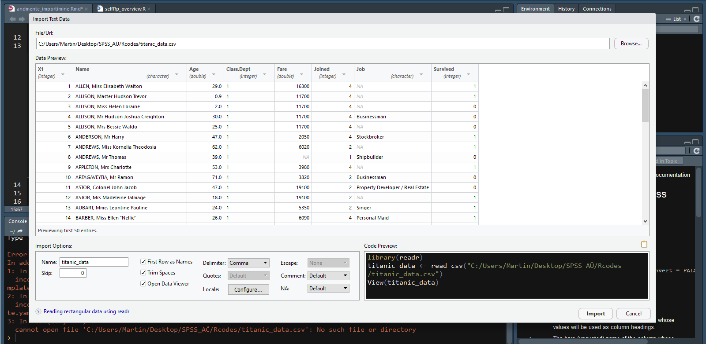

RStudiosse saab andmeid importida kahel viisil. Esimene ja lihtsam viis on kasutada *Environment* paneelil olevat menüüriba *Import Dataset*. Teine viis on kasutada andmete sisselugemiseks loodud funktsioone (nt. read.csv(), read.xslx()). Funktsioonidele antakse argumendiks andmete asukoht arvutis (nt. read.csv("C:/Users/Martin/SPSSpraktikumid/andmed/praktikumi_andmed.csv")). 

## Andmete importimine *Environment* paneeli kaudu
Andmete importimise hõlbustamiseks on RStudios *Environment* paneelis selleks eraldi nupp (Joonis 1.). See võimaldab laadida erinevas formaadis olevaid andmeid (csv, xls, xlsx, sav, dta, por, sas ja stata). 
  

  
Vaatame lähemalt, kuidas importida csv-formaadis olevaid andmeid. Üritage laadida ka enda arvutisse andmestik titanic_data.csv.

- Valige kõigepealt **Import Dataset** menüüst vastav formaat (selle andmestiku puhul CSV). Võimalik, et ekraanile tuleb teade *"Install Required Packages"*. Sel juhul vajutage *"Yes"* ja laske RStudiol vajalikud paketid ära installeerida. Kui see on tehtud, siis avaneb uus aken.     
- Esmalt peate valima **"Browse"** nupu abil arvutis oleva andmestiku.  
- Kui andmestik on valitud, siis peaksite nägema andmestiku eelvaadet (Joonis 2.).    
- Aknas **"Data Preview"** näete, millisel kujul andmestik imporditakse. Siin on oluline, et kõik vajalikud veerud oleksid eraldi.  
- Andmete importimise tulemust saate muuta **Import Options** parameetrite abil. Antud juhul pange linnuke kindlasti *First Row as Names* ette (*Trim Spaces* ei ole määrava tähtsusega, *Open Data Viewer* avab pärast importimist andmestiku RStudio Data Vieweris).   
- Kui veerud ei ole üksteisest eraldatud sellisel viisil nagu peaks, siis peab muutma **Delimiter** parameetrit. Antud juhul peaks sobima "Comma". See ütleb, et meie toorandmetes tähistatakse veergude eraldamist komaga. 

  


  
Exceli failide importimisega võib mõnes arvutis probleeme tekkida. Kõige lihtsam viis neid vältida on salvestada Excelis olev andmefail csv-formaadis.   
Proovige seda teha andmefailiga ANDMED.xls. Teeme sellest failist koopia ja salvestame uue faili csv-formaadis (nimetus tuleb sõnadest *comma separated variable*). Salvestame fail käsklusega Save As... ja paneme faili nimeks ANDMED_R.csv (Joonis 3.). Proovige see andmestik nüüd RStudiosse importida.   

  


## Andmete importimine funktsioonide abil
Paljude andmeformaatide jaoks on R-is olemas spetsiifilised funktsioonid.  
  
* read.csv ja read.csv2 - csv-formaadis olevate andmete jaoks  
* read.xlsx (paketis "xlsx") - excelis olevate andmete jaoks   
* read.spss (paketis "foreign") - SPSS-is olevate andmete jaoks  
* read.table - txt-formaadis olevate andmete jaoks  

Näiteks saame kasutada csv-formaadis andmete sisselugemiseks funktsiooni *read.csv()*.  Funktsiooni esimeseks arugmendiks pange andmestiku asukoht koos andmestiku nimega (minu arvutis oleks esimene argument antud anmete puhul "C:/Users/Martin/Desktop/SPSS_AÜ/Rcodes/ANDMED_R.csv").  

```{r}
andmed <- read.csv("C:/Users/Martin/Dropbox/MyClasses/2017-18/ST2017_AU/Rcodes/ANDMED_R.csv", header=TRUE, sep =";") 
#lisaargumendiga "header" anname teada, et esimesel real on muutujate nimed
#lisaargumendiga "sep" anname teada, missuguse tähistusega eraldatakse veerge (peamised võimalused: sep = "," - eraldajaks koma, sep = " " - erldajaks tühik, sep = ";" - eraldajaks semikoolon, sep = "\t" - eraldajaks TABiga(tabulaatoriga))
```


Ka Exceli failide importimiseks on eraldi funktsioon. Esialgu peame installeerima RStudiosse uue pakti. Meil on vaja paketti *xlsx*, kus on meid huvitav funktsioon. Kirjutage konsoolile järgmine rida:  
```{r, eval = F}
install.packages("xlsx")
```
Nüüd saame kasutada funktsiooni *read.xlsx()*. Esimeseks argumendiks paneme jälle andmestiku asukoha koos andmestiku nimega. 
```{r, warning=F, message=F}
library(xlsx)#teeb paketis olevad funktsioonid aktiivseks. 
andmed <- read.xlsx("C:/Users/Martin/Dropbox/MyClasses/2017-18/ST2017_AU/Rcodes/ANDMED.xls", sheetIndex = 1) 
```

