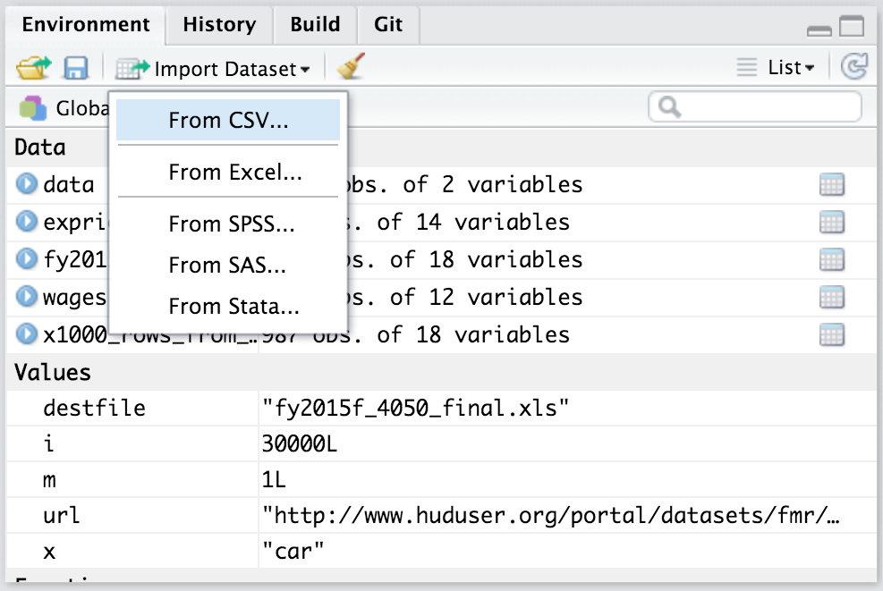

RStudiosse saab andmeid importida kahel viisil. Esimene ja lihtsam viis on kasutada *Environment* paneelil olevat menüüriba *Import Dataset*. Teine viis on kasutada andmete sisselugemiseks loodud funktsioone (nt. read.csv(), read.xslx()). Funktsioonidele antakse argumendiks andmete asukoht arvutis (nt.  read.csv("C:/Users/Martin/KMKT/1praktikum/praktikumi_andmed.csv")). 

# Andmete importimine *Environment* paneeli kaudu
*Environment* paneelis saab avada akna andmete importimiseks (Joonis 1.). See võimaldab laadida erinevas formaadis olevaid andmeid (csv, xls, xlsx, sav, dta, por, sas ja stata). 
   

  
Vaatame lähemalt, kuidas importida csv-formaadis olevaid andmeid. Üritage laadida ka enda arvutisse andmestik [titanic_data.csv](https://drive.google.com/open?id=1yxE15tlAtIMoVa1QHOVJbfxBZXrEDDJ5).

- Valige kõigepealt **Import Dataset** menüüst vastav formaat (selle andmestiku puhul CSV). Võimalik, et ekraanile tuleb teade *"Install Required Packages"*. Sel juhul vajutage *"Yes"* ja laske RStudiol vajalikud paketid ära installeerida. Kui see on tehtud, siis avaneb uus aken.     
- Esmalt peate valima **"Browse"** nupu abil arvutis oleva andmestiku.  
- Kui andmestik on valitud, siis peaksite nägema andmestiku eelvaadet (Joonis 2.).    
- Aknas **"Data Preview"** näete, millisel kujul andmestik imporditakse. Siin on oluline, et kõik veerud oleksid eraldi.  
- Andmete importimise tulemust saate muuta **Import Options** parameetrite abil. Antud juhul pange linnuke kindlasti *First Row as Names* ette (*Trim Spaces* ei ole määrava tähtsusega, *Open Data Viewer* avab pärast importimist andmestiku RStudio Data Vieweris).   
- Kui veerud ei ole üksteisest eraldatud sellisel viisil nagu peaks, siis peab muutma **Delimiter** parameetrit. Antud juhul peaks sobima "Comma". See ütleb, et meie toorandmetes tähistatakse veergude eraldamist komaga. 

  


  
Exceli failide importimisega võib mõnes arvutis probleeme tekkida. Kõige lihtsam viis neid vältida on salvestada Excelis olev andmefail csv-formaadis.   
Proovige seda teha andmefailiga [ANDMED.xls](https://drive.google.com/open?id=1mjE0rCsudjEmKnkCGjKXdfxKqUmyHUsY). Teeme sellest failist koopia ja salvestame uue faili csv-formaadis (nimetus tuleb sõnadest *comma separated variable*). Salvestame fail käsklusega *Save As...* ja paneme faili nimeks ANDMED_R.csv (Joonis 3.). Proovige see andmestik nüüd RStudiosse importida.   

  


# Andmete importimine funktsioonide abil
Laadige enda arvutisse järgmised andmestikud:    
1) [Andmestik nimega Kysimustik](https://drive.google.com/open?id=1SMASCTWq6upqWQTb9Tjb61O1jQWgiF4O)(csv-formaadis)    
2) [Andmestik nimega Kysimustik](https://drive.google.com/open?id=1vzgv5gnOM_E-Nrs-zqQbsNbctHjS90mH)(xls-fomraadis)    
2) [Andmestik nimega PISA2009](https://drive.google.com/open?id=1N0OBaky-pajTGIdGIfoFU-QkXa9bLevh)(sav-fomraadis)    


## Excel
Andmete Excelist R-i saamiseks on mitu erinevat võimalust. Vaatame kõige tüüpilisemalt kasutatavat viisi, mis ei eelda lisamooduli kasutamist. Selleks tuleks avada andmed kõigepealt Excelis ja salvestada need komaga eraldatud csv-formaadis (nimetus tuleb sõnadest *comma separated variable*). Nüüd saame andmed csv-failist R-i lugeda funktsiooni *read.csv()* abil.  
```{r}
kysimustik <- read.csv("KMKT/2praktikum/Kysimustik.csv", header=TRUE) #lisaargumendiga "header" anname teada, et esimesel real on muutujate nimed
# NB! Kui töökausta ei ole määratletud, siis peab andma terve asukoha. Antud juhul on töökasuta määratletud ja andmed on alamkaustas KMKT ja 2praktikum
```

Koodirida paigutab andmed tabelisse nimega *kysimustik*. Funktsiooni *read.csv()* argument *header=TRUE* ütleb, et csv-faili esimeses reas paiknevad muutujate nimed. Environment-paneelis näeme, et sisseloetud andmestikus on R-i arvates 24 rida ja ainult 1 tulp. Tundub, et midagi on natuke valesti läinud.

Antud juhul on asi selles, et csv-faile on kahte tüüpi: nii-ölda Euroopa ja Ameerika tüüpi. Mandri-Euroopa maades, kasutatakse murdarvude puhul kümnendosa eraldajana koma. Seetõttu ei saa koma csv-failis väljade eraldajana enam kasutada ja selle asemel on kasutusel hoopis semikoolon. Kui meil on eestikeelne Excel, siis tõenäoliselt salvestab see csv-faile just semikoolonitega variandis. Kui klõpsame Environment-paneelis tabeli nime peal ja meile avaneb andmestik, siis on seal tõepoolest näha üsna palju semikooloneid. R-is on 2 csv-failide lugemise funktsiooni:  

1) read.csv - Ameerika tüüpi csv-failide jaoks, milles kümnendkohta eraldab punkt ja andmevälju koma ning
2) read.csv2 - Euroopa tüüpi csv-failide jaoks, milles kümnendkohta eraldab koma ja andmevälju semikoolon. Praegu lähebki meil vaja hoopis funktsiooni read.csv2.

Meie probleemi lahendamiseks on kaks võimalust.  
Esiteks saame kasutada funktsiooni read.csv2(), kus on juba vaikimisi määratud andmevälju eemaldavaks tunnuseks seminkoolon. See on eriti kasulik juhul, kui andmetest eraldab kümnenkohti koma.     
```{r}
kysimustik <- read.csv2("KMKT/2praktikum/Kysimustik.csv", header=TRUE) #andmevälju eraldab semikoolon
```
Teiseks saame anda funktsioonile read.csv() lisaargumendiga teada, et meie andmetes eraldab andmevälju semikoolon.
```{r}
kysimustik <- read.csv("KMKT/2praktikum/kysimustik.csv", header = TRUE, sep =";") #Argument "sep" võimaldab täpsustada andmeväljade eraldamise viisi toorandmetes.
```


### Uue mooduli installeerimine  
Kui kasutate sageli Excelist pärinevaid andmeid, võib csv-failidega majandamine minna natuke tüütuks. Sellisel juhul on abi lisamooduli *xlsx* funktsioonist *read.xlsx*, mis oskab lugeda Exceli *xls* ja *xlsx* failiformaate otse R-i. Lisamoodul *xlsx* tuleb aga kõigepealt installida.

```{r, eval = F}
install.packages("xlsx")
```

Nüüd tuleb natuke oodata kuni R moodulit installib. Seejärel saame lisamooduli laadida. Mooduli laadimine R-is tagab moodulis olevatele funktsioonidele juurdepääsu.  

```{r, warning = FALSE, message=FALSE}
library(xlsx) #mooduli aktiviseerimine - tagab mooduli funktsioonidele juurdepääsu
```

Seejärel saame funktsiooni *read.xlsx* abil andmestiku sisse lugeda.
```{r, warning = FALSE, message=FALSE}
kysimustik <- read.xlsx("KMKT/2praktikum/Kysimustik.xls", sheetIndex=1)
```


Kuna Exceli failides võib olla mitu töölehte, tuleb funktsioonile argumendi *sheetIndex* abil öelda, mitmendat töölehte me sisselugeda soovime. Selle asemel võib kasutada ka argumenti *sheetName* ja töölehe nimetust. Funktsiooni *read.xlsx* puhul on argumendi *header* väärtus juba vaikimisi *TRUE*, nii et seda me praegusel juhul täpsustama ei pea. (Kui me ei taha, et R kohtleks esimese rea andmeid muutujate nimedena, tuleks seda talle öelda *header=FALSE* abil)

##SPSS

SPSS-i andmefaile saab R-i lugeda lisamooduli *foreign* funktsiooni *read.spss* abil. Lisamoodul *foreign* tuleb R-i installatsiooniga kaasa, seetõtuu pole seda vaja eraldi installida. Küll aga peab selle laadima.

```{r, warning = FALSE, message=FALSE}
library(foreign)
pisa <- read.spss("KMKT/2praktikum/PISA2009.sav", to.data.frame=TRUE, use.value.labels=FALSE)
```


Funktsiooni *read.spss* sagedamini vajaminevad lisaargumendid on: 

1) *to.data.frame=TRUE* -  ütleb, et soovime andmeid laadida andmetabeli kujul;  

2) *use.value.labels=FALSE* - kasulik, kui meil on SPSS-is Likerti tüüpi andmete puhul määratud iga väärtuse jaoks mingi silt nt 1="täiesti vale". Sellisel juhul ütleb see argument, et soovime andmeid laadida numbrilisel mitte tekstilisel kujul.
  
Lõpetuseks veel töökausta määramisest. Põhimõtteliselt on võimalik jätta ka töökaust määramata ja valida fail interaktiivselt. Seda saab teha kui kirjutada sisselugemiseks kasutatavasse funktsiooni faili nime argumendi väärtuseks file.choose(). Näiteks niimoodi:

```{r, eval = F}
pisa <- read.spss(file.choose(), to.data.frame=TRUE, use.value.labels=FALSE)
```

Peaks avanema aken (NB! See ei pruugi olla esiplaanil), mis võimaldab andmefaili valida ja kui me valime praegusel juhul sellesama faili PISA2009.sav, peaks ka lõpptulemus olema sama. On maitse küsimus, kas eelistada töökausta määramist Files-paneeli abil või kasutedes viimati mainitud file.choose() meetodi.


