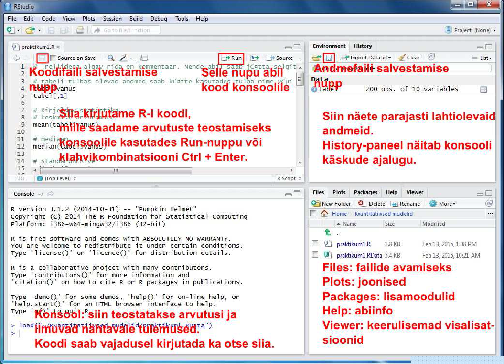
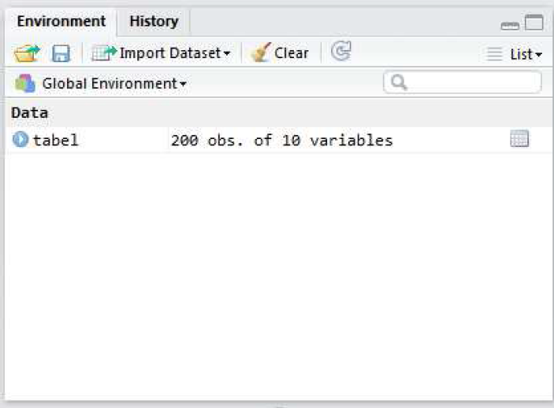
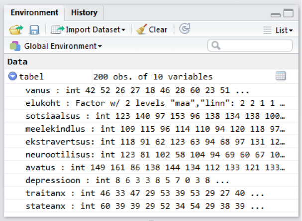

<script src="hideOutput.js"></script>
```{r global_options, include=FALSE, echo = F}
knitr::opts_chunk$set(fig.width=12, fig.height=8,
                      eval=FALSE, warning=FALSE, message=FALSE)
```

  
# Praktikumi eesmärgid

* RStudio kasutamisega tutvumine: andmete laadimine R'i, andmeväljadele viitamine R'is  
* Üldine kirjeldav statistika: keskmine, mediaan, stadnadrhälve jne  
* Korrelatsiooni kasutamine  
* T-testi kasutamine  

# RStudio paigaldamine  
Arvutiklassi arvutites on need programmid juba olemas, aga kui on soovi paigaldada RStudio ka enda arvutisse, siis kasutage järgnevaid linke:  

* programmeerimiskeel R -  http://ftp.eenet.ee/pub/cran  
* RStudio - http://www.rstudio.com/products/rstudio/download

# 1. RStudio kasutamine   

Laadige alla praktikumi koodi ja andmeid sisaldav zip-fail Moodle'ist. Pakkige zip-fail lahti. Selles on 2 faili:
koodifail praktikum1.R ja andmefail praktikum1.RData.  

Käivitame RStudio. Avanema peaks allolev pilt.


Avame zip-failis olnud koodifaili praktikum1.R ja andmefaili prakitkum1.RData kasutades ülaloleval joonisel osutatud nuppe või RStudio aknas paremal all osas paiknevat paneeli *Files*. Kui soovime olemasoleva koodifaili asemel avada hoopis uut tühja koodifaili, siis seda saab teha valides RStudio menüü-ribalt *File* ja sellest *New File* -> *R Script*.

Nüüd peaks meil RStudio aknas lahti olemas 4 osa. Erinevate osade funktsioonid on toodud allpool.



**Üleval vasakul** olevasse ossa kirjutame koodi, mille abil ütleme R-ile, mida me tahame, et see andmetega teeks. Kuidas koodi R-ile saatmine käib? Kui soovime saata ainult ühte rida korraga tuleb kõige pealt klõpsata sellel koodireal, mida soovime R-ile saata (nii et kursor hakkab vilkuma sellel real) ja seejärel vajutada koodiredaktori paneeli paremal ülaosas paiknevat nuppu *Run*. Nupu asemel võib kasutada ka klahvikombinatsiooni *Ctrl + Enter* (Maci arvutitel *Cmd + Enter*). Kui soovime saata mitut koodirida korraga, tuleb need koodiredaktoris valida (st teha hiirega siniseks) ja seejärel vajutada *Run*-nuppu või klahvikombinatsiooni.

**All vasakul** on konsool (*Console*). Seal asubki arvutusi teostav R ise. Kui laseme R-il midagi arvutada, ilmuvad tulemused nähtavale just selles osas. Koodi võib põhimõtteliselt kirjutada ka otse siia, aga enamasti on mugavam kirjutada kood üleval valmis ja seejärel alla konsooli saata. Nii on lihtsam koodi vajadusel parandusi teha ja koodi korduvkasutada.

**All paremal** asub 5 erinevat paneeli:

* *Files*: R-i koodi ja andmefailide avamiseks.  
**NB!** Selles aknas saate sättida enda töökeskkonda. See annab R'ile teada, missuguse kaustaga parasjagu tööd tehakse. Kausta otsimiseks vajutage sümbolile "...", otsige üles sobiv kaust ja vajutage "OK". Seejärel vajutage nupule *More* ja valige *Set As Working Directory*. Jälgige alati, et töökekskond oleks kaust hetkel kasutatavate andmetega.   
* *Plots*: selles osas ilmuvad nähtavale joonised.  
* *Packages*: selle osa abil saab installida ja laadida lisamooduleid, mis lisavad R-ile täiendavat funktsionaalsust. Lisamoodulid tuleb kõigepealt installida, st öelda R-ile, see tõmbaks mooduli internetist antud arvutisse. Seda saab teha vajutades paneelil nuppu *Install* ja kirjutades avanevasse aknasse meid huvitava lisamooduli nime. Kui R on mooduli installinud, tuleb see ka laadida. Laadimiseks tuleb vajaminev moodul *Packages*-paneeli nimekirjast üles otsida ja selle nime eesasuvasse kasti linnukene teha. Lisamooduleid saab installida ja laadida ka R-i koodi abil - *library("lisamooduli nimi")*.    
* *Help*: Abiinfo R-i funktsioonide kohta. Kirjutades paneeli otsingukasti meid huvitava R-i funktsiooni nime ja vajutades Enterit, näidatakse infot funktsiooni kasutamise kohta. Abiinfo lehe lõpus on toodud ka näited selle konkreetse funktsiooni kasutamise kohta.  
* *Viewer*: Selle osa abil saab teha keerulisemat tüüpi andmevisualisatsioone, millel on lisaks joonisele ka kontrollelemendid, mis võimaldavad joonise parameetreid muuta. Seda osa me antud kursusel ei kasuta.  

**Üleval  paremal** asub 2 paneeli:

* *Environment*: selles osas näidatakse parajasti lahti olevaid andmeid.
* *History*: R-i konsooli käskude ajalugu.
Natuke lähemalt *Environment* paneelist. Kui avasite alguses andmefaili *praktikum1.RData*, peaks paneel välja nägema nagu alloleval pildil. Muutuja *tabel* viitab konkreetse andmetabeli nimele. Erinevalt näiteks SPSS-ist võivad R-i andmefailid sisaldada rohkem kui ühte andmetabelit (ja lisaks andmetabelitele ka teistsuguseid andmestruktuure). Igal andmetabelil on oma nimi ja tabelis olevad andmed saamegi hiljem kätte just selle nime abil. 200 obs of 10 variables näitab, et tabelis on 200 rida ja 10 tulpa.




Klõpsates tabeli nime ees oleval sinisel nupul peaks avanema allolev pilt.




Meile näidatakse tabelis olevate tulpade nimesid, andmetüüpe ja esimesi andmepunkte. Esimene tulp/muutuja kannab nime "vanus". Andmetüüp on *int* , mis tuleb inglisekeelsest sõnast *integer* ehk täisarv, st. tegemist on tulbaga, milles sisalduvad andmed on täisarvud. (Teine R-is levinud numbriliste andmete tüüp on *num* ehk *numeric*, mis võib sisaldada ka komakohaga arve.) Teine tulp
kannab nime "elukoht"" ja selle tüübiks on märgitud *Factor* w/ 2 levels „maa“ , „linn“. *Factor* tähendab R-i kontekstis kategooriaid sisaldavat muutujat. Antud juhul on neid kategooriaid 2 tükki: „maa“ ja „linn“. Kõik ülejäänud tabelis olevad muutujad sisaldavad sarnaselt esimese tulbaga täisarvulist tüüpi andmeid (*int*).
  
   
**Ülesanded - RStudio kasutamine**  

1. Looge uus muutuja nimega "uus_muutuja". Andke sellele muutujale numbriline väärtus.  
2. Korrutage see muutuja kahega. Võtke see muutuja ruutu.    
3. Kasutage funktsiooni *head()*, argumendiks pange andmesitiku nimi. Mida see funktsioon näitab?   
4. Kaustage funktsiooni *str()*, argumendiks pange andmesitiku nimi. Mida see funktsioon näitab?   

# 2. Andmetega manipuleerimine

Enne alustamist veenduge, et Teil oleks RStudio töökeskkonnas (*Global Environment*) vastav andmetabel olemas (Joonis 3.).  

R'i üks suurimaid eeliseid SPSS'i ees on võimalus andmeid kiirelt kohandada enda vajadustele.   

Siin tutvustame kolme võimalust:

* Dollari märrgi abil viitamine  
* Nurgelist sulgude kasutamine - R'is annavad nurgelised sulud märku, et mingist objektist/andmestikust tahetakse mingit konkreetsemat muutujat kätte saada.  
* Funktsioon *subset* - See funktsioon võimaldab teha sama, mida nurgelised sulud.   

**Veergude erladamine**  
R'is saab kergesti kasutada funktsioone muutujate peal eraldi. Et arvutada tabelis oleva muutuja kohta statistilisi näitajaid, peame teadma, kuidas tulbas olevad andmed koodi abil kätte saada. Selleks peame teadma nii andmetabeli nime kui ka tulba nime või tulba järjekorranumbrit. Tulbas vanus olevad andmed saame muutuja nime abil kätte nii:  

Dollari märgi abil:   

```{r}
tabel$vanus
```

Nurgeliste sulgudega:

```{r, eval = FALSE}
tabel[,1]
```

Funktsiooniga *subset*:

```{r , eval = FALSE}
subset(tabel, select = vanus) # üks veerg
subset(tabel, select = c(vanus, elukoht)) # kaks veergu. NB! lisasime c() - see näitab, et anname argumendiks vektori. 
```

Kuidas eemaldada veerge?  
Kasutage miinusmärki:  

```{r, eval = FALSE}
subset(tabel, select = -c(vanus, elukoht)) # eemaldab veerud vanus ja elukoht
tabel[,1] # eemaldab esimese veeru
tabel[-1,] # eemaldab esimese rea
```

**Ridade eraldamine**  
Järjekorra numbri abil saab ridasid samamoodi eraldada nagu veerge:

```{r , eval = FALSE}
tabel[1,] #esimne rida
```


```{r, eval = FALSE}
tabel[1:5,] #esimesed viis rida
```

**Tingimuste kasutamine**  
Kuidas valida ridu, mis vastavad teatud tingimustele? Proovime näiteks võtta andmestikust need read, kus vaadeldava isiku vanus on alla 30.
Nurgeliste sulgudega:

```{r, eval = FALSE}
tabel[tabel$vanus<30,]
```

Funktsiooniga *subset*:

```{r, eval = FALSE}
subset(tabel, vanus < 30)
```

Sageli on vaja võtta andmetest välja read, mis on ühe muutuja suhtes võrdsed. Näiteks püüame eraldada andmetest kõik read, kus elukoha väärtus on "maa". Saame kasutada juba tuttavat ridade ja veergude määratlust:  

```{r, eval = FALSE}
tabel[tabel$elukoht == "maa",] 
```

Samasuguse tulemuse saame ka funktsiooniga *subset*  

```{r, eval = FALSE}
subset(tabel, elukoht == "maa")
```
  
   
**Ülesanded - andmetega manipuleerimine**  
1. Eraldage andmetest veerg "vanus". Looge uus muutuja, kus on ainult see veerg.  
2. Tehke kaks uut andmestikku. Esimesse salvestage maal elavata katseisikute tulemused ja teise salvestage linnas elavate katseisikute tulemused.  


# 3. Kirjeldav Statistika  
Nüüd, kui teame, kuidas anda R'ile edasi ainult üks muutuja andmestikus, proovime saada selgemat ülevaadet muutujast *vanus*.  
**Kekmise** vanuse saame andes funktsioonile *mean* argumendiks muutuja *vanus*:

```{r}
mean(tabel$vanus)
```

**Mediaani** saame funktsiooni *median* abil

```{r}
median(tabel$vanus)
```

**Standardhälve**

```{r}
sd(tabel$vanus)
```

**Miinimum** ja **maksimum**

```{r}
min(tabel$vanus)
max(tabel$vanus)
```

**Puuduvad väärtused**  
Kui tulbas esineb puuduvaid väärtusi, annab R meile statistiku väärtuseks samuti puuduva väärtuse ehk NA (*not available*):

```{r}
mean(tabel$sotsiaalsus)
```

Selleks, et puuduvad väärtused arvutustest välja jätta tuleb kirjeldava statistika funktsioonidele ette anda täiendav argument na.rm=TRUE

```{r}
mean(tabel$sotsiaalsus, na.rm=TRUE)
median(tabel$sotsiaalsus, na.rm=TRUE)
```

Kategooriaid sisaldava tunnuse kirjeldamisel on abiks **sagedustabel**:

```{r}
table(tabel$elukoht)
```

Protsentuaalse jaotuse saame lisades sagedustabeli ümber funktsiooni *prop.table*:

```{r}
prop.table(table(tabel$elukoht))
```
  
   
**Ülesanded - kirjeldav statistika**  
1. Leidke sotsiaalsuse, meelekindluse, ekstravertsuse, neurootilisuse ja avatuse keskmised tulemused.  
2. Kasutage funktsiooni *summary()*. Andke argumendiks üks veerg. Andke argumendiks terve tabel. Mida see funktsioon väljastab?  
3. Millises vahemikus varieeruvad ekstravertsuse skoorid?


# 4. Korrelatsioon  
Kahe muutuja vahelise korrelatsioonikordaja väätuse saame andes need muutujad argumentideks funktsioonile *cor*:

```{r}
cor(tabel$vanus, tabel$depressioon)
```


Funktsioonile *cor* saab ette anda ka mitu muutujat korraga kasutades andmetabeli tulpade järjekorranumbreid. Sellisel juhul tagastatakse meile korrelatsioonimaatriks.

```{r}
cor(tabel[,3:7])
```


Nagu näha on mõnede korrelatsioonikordajate väärtuseks puuduv väärtus ehk NA. Funktsiooni *cor* puhul käib puuduvate väärtuste välja jätmine argumendi *use* abil. *use="complete.obs"* jätab kasvõi ühe puuduva väärtusega inimese andmed välja kõigist arvutustest. *use="pairwise"* jätab inimese välja aga ainult nendest arvutustest, mille puhul tal esineb puuduvaid andmeid:

```{r}
cor(tabel[,3:7], use="complete.obs")
```


Kuna antud juhul on puuduvaid andmeid väga vähe, on puuduvate andmete eemaldamise meetodi kasutamise puhul erinevused vaevumärgatavad:

```{r}
cor(tabel[,3:7], use="pairwise")
```


Korrelatsioonimaatriksit on enamasti parem jälgida väiksema komakohtade arvu puhul.
Ümardamise saame lisades funktsiooni cor ümber funktsiooni round ja andes sellele ette soovitava komakohtade arvu.

```{r}
round(cor(tabel[,3:7], use="complete.obs"), 2)
```


Vahel soovime teada ka korrelatsioonikordaja statistilist olulisust. Selle saame funktsiooni cor.test abil.

```{r}
cor.test(tabel$neurootilisus, tabel$stateanx)
```

Funktsiooni väljund näeb välja selline:
P-väärtus on väljundis antud kujul 4.809e-13. See tähistab arvu 4.809 korda 10 astmel -13, \(4.809 \times 10^{-13}\) ehk tegemist on väga väikese arvuga ja seega võib korrelatsioonikordajat lugeda statistiliselt oluliseks. Väga väikeste või väga suurte arvude puhul kasutabki R-i sellist tähistust.   
   
**Ülesanded - korrelatsioon**  
1. Kui tugev on seisundi- ja püsiärevuse vaheline korrelatsioon?  
2. Kui tugev on neurootlisuse ja ekstravertsuse vaheline korrelatsioon?  
3. Kui tugev on depressiooni ja püsiärevuse vaheline korrelatsioon?  
4. Kas need korrelatsioonikordajad on statistiliselt olulised?  

# 5. T-test
T-testi abil saab võrrelda, kas kahe grupi keskmised erinevad statistiliselt olulisel määral. T-testi saab R-is kätte andes funktsioonile t.test ette numbrilise tunnuse (antud juhul vanus) ja grupeeriva tunnuse (antud juhul elukoht) alljärgneval kujul:

```{r}
t.test(tabel$vanus~tabel$elukoht)
```


või sellisel kujul:
```{r, message=FALSE, warning=FALSE}
t.test(vanus~elukoht, data=tabel)
```
  
   
**Ülesanded - t-test**  

1. Kas maa- ja linnaelanike keskmised erinevad...

* avatuse osas?
* ekstravertsuse osas?
* sotsiaalsuse osas?
* meelekindluse osas
* neurootilisuse osas?


## Mõned huvitavad lingid
Allpool on toodud mõned veebilehed, mis võivad osutuda kasulikuks, kui soovite R-i omal käel natuke lähemalt tundma õppida.

* http://tryr.codeschool.com/ - interaktiivne veebikursus R-i põhitõdedest  
* http://health.adelaide.edu.au/psychology/ccs/docs/lsr/lsr-0.4.pdf - psühholoogiatudengitele suunatud raamat statistikast ja R-ist. 
* http://statmethods.net/


