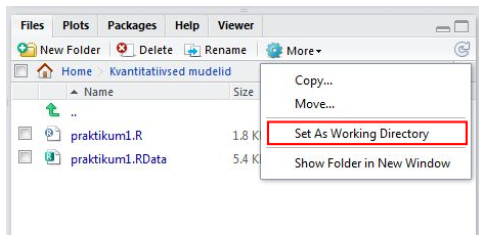

```{r, echo = FALSE, message = F, warning=F}
library(ggplot2)
load("KMKT/2praktikum/2praktikumAndmed.Rdata")
```

```{r global_options, include=FALSE, echo = F}
knitr::opts_chunk$set(fig.width=8, fig.height=6, fig.path='Figs/',
                      eval=TRUE, warning=FALSE, message=FALSE)
```

#Praktikumi eesmärgid

* Vaatame üle, kuidas lugeda andmeid RStudiosse
* Jooniste abil andmetega tutvumine   
* Korrelatsioonanalüüs ja hajuvusdiagramm  
* Keskmiste võrdlemine kahe grupi korral  

Laadige alla [praktikumi andmed](https://drive.google.com/open?id=1xHiis3zt-LOlam2BOL1HqIYBq2XwBqlQ).

# Töökausta määratlemine
Alustuseks peaksime rääkima sellisest mõistest nagu R-i töökaust. Kui me RStudio käivitame, määrab R ära kausta, millest ta vaikimisi faile otsima hakkab. Kui tahame salvestada andmeid või jooniseid, siis salvestatakse ka need vaikimisi just sinna kausta. Seda kausta nimetataksegi R-i töökaustaks. Windowsi arvutis on vaikimisi töökaustaks *My Documents*. Andmefailid, mida me laadida tahame, paiknevad tõenäoliselt mõnes muus kaustas või alamkaustas. R-i töökausta muutmiseks peaksime otsima RStudio *Files*-paneeli (akna alumises parempoolses nurgas) abil üles selle kausta, milles meid huvitav andmefail paikneb. Seejärel peaksime muutma selle kausta R-i töökaustaks, vajutades *Files*-paneeli ülaosas asuvat nuppu *More* ja valides avanevast menüüst *Set As Working Directory*.   



##Kordamine  
Kasutame andmestikku PISA.   

1. Tehke praktikumi materjalide jaoks arvutis eraldi kaust. Tõstke materjalid sinna kausta ja laadige need RStudiosse.   
2. Leidke uuringus osalenute keskmine vanus.  
```{r, eval = T, echo = T}
mean(pisa$AGE)# keskmise arvutamiseks sai kasutada funktsiooni mean()
#summary(pisa)#annab ülevaate tervest andmestikust
```

3. Leidke tüdrukute ja poiste keskmine vanus.  
```{r, eval = T, echo = T}
mean(pisa[pisa$Gender==1, "AGE"])
mean(pisa$AGE[pisa$Gender == 1])
mean(pisa[pisa$Gender==2, "AGE"])
sd(pisa[pisa$Gender==1, "AGE"])
sd(pisa[pisa$Gender==2, "AGE"])
```

4. Kui palju tüdrukuid ja poisse oli uuringus (1 = tüdruk, 2 = poiss)?   
```{r, eval = T, echo = T}
table(pisa$Gender)
mean(pisa[pisa$Gender==2, "AGE"])
```

5. Kui palju õpilasi oli erinevates klassides (GR - klassid)?  
```{r, eval = T, echo = T}
table(pisa$GR)
```


# Andmete sisselugemine Excelist ja SPSS-ist
RStudiosse saab andmeid laadida mitmel erineval viisil. Selles praktikumis vaatame kõige kiiremat moodust - andmete laadimine funktsioonide abil. Teiste viisidega tutvumiseks vaadake lisamaterjalide alt konspekti Andmete Importimine.    
Laadige enda arvutisse:  
1) [Andmestik nimega Kysimustik](https://drive.google.com/open?id=1SMASCTWq6upqWQTb9Tjb61O1jQWgiF4O)(csv-formaadis);   
2) [Andmestik nimega Kysimustik](https://drive.google.com/open?id=1vzgv5gnOM_E-Nrs-zqQbsNbctHjS90mH)(xls-fomraadis).      
   
Paljude andmeformaatide jaoks on R-is olemas spetsiifilised funktsioonid:  
    
* read.csv ja read.csv2 - csv-formaadis olevate andmete jaoks;   
* read.xlsx (paketis "xlsx") - Exceli failide jaoks;    
* read.spss (paketis "foreign") - SPSS failide jaoks;   
* read.table - txt-formaadis olevate andmete jaoks.   

Csv-formaadis olevate andmete sisselugemiseks saame kasutada funktsiooni *read.csv()*.  Funktsiooni esimeseks arugmendiks pange andmestiku asukoht koos andmestiku nimega (minu arvutis oleks esimene argument antud andmete puhul "C:/Users/Martin/ownCloud/rojects/Rwebsite/martinkolnes.github.io/KMKT/2praktikum/Kysimustik.csv").  

```{r, eval = F}
andmed <- read.csv("C:/Users/Martin/ownCloud/Projects/Rwebsite/martinkolnes.github.io/KMKT/2praktikum/Kysimustik.csv", header=TRUE, sep =";") 
#lisaargumendiga "header" anname teada, et esimesel real on muutujate nimed
#lisaargumendiga "sep" anname teada, missuguse tähistusega eraldatakse veerge (peamised võimalused: sep = "," - eraldajaks koma, sep = " " - erldajaks tühik, sep = ";" - eraldajaks semikoolon, sep = "\t" - eraldajaks TABiga(tabulaatoriga))
```


Excelis olevate andmete importimiseks peame esialgu installeerima RStudiosse uue pakti nimega *xlsx*. Kirjutage konsoolile järgmine rida:  
```{r, eval = F}
install.packages("xlsx")
```
Nüüd saame kasutada selles paketis olevat funktsiooni *read.xlsx()*. Esimeseks argumendiks paneme jälle andmestiku asukoha koos andmestiku nimega. 
```{r, warning=F, message=F, eval = F}
library(xlsx)#teeb paketis olevad funktsioonid aktiivseks. 
andmed <- read.xlsx("C:/Users/Martin/ownCloud/Projects/Rwebsite/martinkolnes.github.io/KMKT/2praktikum/Kysimustik.xls", sheetIndex = 1) 
```


# Jooniste abil andmetega tutvumine  

Jooniste tegemiseks soovitame kasutada paketti *ggplot2*. See on populaarne R'i pakett, mis võimaldab vähese vaevaga teha ilusaid jooniseid. Selles paketis on kaks funktsiooni jooniste tegemiseks: *ggplot()* ja *qplot()*. Meie soovitame kasutada funktsiooni *ggplot()*, sest see on paindlikum ja võimaldab erinevaid andmestikke ühele joonisele lisada.  

Ülevaade selles paketis olevatest erinevatest funktsioonidest leiate lehelt http://docs.ggplot2.org/current/. 

Vaatame esmalt üle, missugune on funktsioonile *ggplot()* antavate argumentide järjekord.
```{r, eval = FALSE}
library(ggplot2)# esmalt aktiveerime paketi. NB! pakett peab olema enne installeeritud
ggplot(andmed, aes(x = tunnus1, y = tunnus2)) #See on struktuur, mida saate alati joonise tegemisel kasutada.
```
Sellisel kujul me veel ei näe joonist. Joonise ehitamine *ggplot()* funktsiooniga toimub kihtide alusel. Me peame lisama kihi, mis loob x ja y elementidest vastava struktuuri (sõltub sellest, kas tahame tunnuseid näha punktidena, tulpadena, ühendatud joontega jne.). Tulpade joonistamiseks peaksime lisama *geom_bar()*:
```{r, eval = FALSE}
ggplot(andmed, aes(x = tunnus1, y = tunnus2)) +
        geom_bar()
```


## Histogramm
Numbriliste tunnuste puhul peaks vaatama, milline on andmete jaotus. See annab meile ettekujutuse sellest, kas andmed on enam-vähem normaaljaotusega ja kas esineb üksikuid äärmuslikke väärtusi. Andmestikus PISA on kolm olulist tunnust, mille jaotust võiks uurida: lugemine (skoor muutujas nimega PV1READ), matemaatika (PV1MATH) ja loodusteadused (PV1SCIE). Teeme histogrammi lugemise alatesti skooride (PV1READ) jaotuse kohta.

```{r}
ggplot(pisa, aes(x=PV1READ))+
        geom_histogram()
```

Histogrammi välimuse muutmiseks saab funktsioonile lisada erinevaid argumente:

* *labs()* - võimaldab muuta joonise pealkirja, x-ja y-telje nimesid (labs(title= "jooniuse pealkiri", x = "x-telje nimi", y = "y-telje nimi")).
* *xlim()* - horisontaaltelje otspunktide väärtused. Otspunktide väärtused tuleb anda funktsiooni c() sees, nt nii: xlim(c(100, 800))  
* *ylim()* - vertikaaltelje otspunktide väärtused, samal kujul nagu argument xlim.  
* *col* - tulpade värv. See argument lisatakse tavaliselt joonise struktuuri täpsustava kihi juurde (näiteks geom_histogram(col = "blue", fill = "green")). Värvi väärtust saab muuda kahel viisil: 1) värvi nimega(nt "grey", "red", "blue"); 2) peenemaid värvitoone saab valida värvi heksadetsimaalkoodi abil (nt #FF0000 on punase värvi kood). Need koodid leiata, kui guugledate *hexadecimal color codes*.  
* vormide kasutamine - joonisele saab lisada juba eelnevalt seadistatud vormi, mis kujundab joonise välimust. Näiteks argument *theme_bw()* annab joonisele valge tausta. Mõned klassikalised vormid leiata lehelt https://www.r-bloggers.com/ggplot2-themes-examples/. 

Kui sooviksime teha ülalolevat histogrammi natuke ilusamaks, siis võiksime koodi lisada järgmised täpsustused:  
```{r}
ggplot(pisa, aes(x=PV1READ))+ #pluss märk näitab, et me liidame siia veel ühe argumendi juurde
        geom_histogram(col = "blue", fill = "gray")+
        labs(title = "Lugemise alatesti skooride jaotus", x ="Alatesti skoor" , y = "Sagedus")+
        theme_bw()
        
```

Kui tahate joonist suuremal kujul vaadata, siis vajutage RStudio *Plots*-paneelil olevat nuppu *Zoom*. Joonise pildifailina salvestamiseks vajutage nuppu *Export* ja valige avanevast menüüst *Save as Image*.  

**Ülesanne**  
1. Tehke histogramm loodusteaduste (PV1SCIE) tulemustega.  
```{r}
ggplot(pisa, aes(x = PV1SCIE))+
        geom_histogram()+
        labs(title = "Loodusteaduste testi tulemuste jaotus", x ="Alatesti skoor" , y = "Sagedus")+
        theme_bw()
```

  
##Tulpdiagramm (*barplot*)
Kategooriatest koosneva tunnuse sageduse kujutamiseks kasutatakse tulpdiagrammi. Veerus nimega GR (*grade*) on kirjas õpilase klass. Teeme selle tunnuse kohta tulpdiagrammi:

```{r}
ggplot(pisa, aes(GR))+
        geom_bar()+
        labs(x ="klass" , y = "õpilasi valimis")+
        theme_bw()
```


Näeme, et enamik antud valimis olevatest õpilastest käivad 8. või 9. klassis. Tulpdiagramm on eriti kasulik juhul, kui kategooriaid on rohkem. See annab meile hea ülevaate gruppide suurustest ja võimaldab tuvastada teistest eristuvaid gruppe.   
  
**\*LISA**  
Tulpdiagrammi abil saab ka kujutada gruppide keskmisi tulemusi. Kujutame näiteks matemaatika skoori keskmisi tulemusi klasside lõikes. Selle tegemiseks peame lisama kihile *geom_bar* kaks argumenti: "stat = "summary""" ja "f"un.y = "mean"". Need argumendid näitavad, et me kasutame joonise tegemiseks keskmisi tulemusi.  
 
```{r}
ggplot(pisa, aes(y=PV1MATH, x = GR))+
        geom_bar(aes(group = GR), stat = "summary", fun.y = "mean") +
        labs(x ="klass" , y = "matemaatika alatesti keskmine skoor")
```

Kontrollimise mõttes võiks need tulemused arvutada ka funktsiooniga *mean*. Gruppide lõikes mingi kirjeldava statistika näitaja arvutamiseks soovitan kasutada funktsiooni nimega *tapply*.  
Funktsiooni *tapply* argumentideks on 1) numbriline tunnus, 2) grupeeriv tunnus, 3) kirjeldava statistika funktsiooni nimetus (nt mean, median, sd), 4) na.rm=TRUE juhul kui andmetes esineb puuduvaid väärtusi. 
```{r, eval = FALSE}
tapply(sõltuv tunnus, grupeeriv tunnus, kasutatav funktsioon)
```

```{r}
tapply(pisa$PV1MATH, pisa$GR, mean, na.rm=TRUE)
```

## Normaaljaotuse testmine  
Teeme siinkohal väikse kõrvalepõike nomraaljaotuse testimise juurde. Histogrammide abil saime üldise ettekujutuse andmete jaotusest, aga me peaksime hindama seda ka statistiliselt. Üks levinumaid statistilisi meetodeid normaaljaotuse kontrollimiseks on Shapiro Wilki test.
Selle testi väljundist tuleb vaadata *p-value*-t. Kui *p-value* on väiksem kui 0.05, siis ei ole andmed selle testi kohaselt normaaljaotuslikud.
Vaatame kahe muutuja jaotust (PV1READ, JOYREAD) sugude lõikes.
```{r}
# Kontrollime naiste(1) puhul tunnuse "PV1READ" normaaljaotust:
shapiro.test(subset(pisa$PV1READ, pisa$Gender == 1)) 
# Kontrollime meeste(2) puhul tunnuse "PV1READ" normaaljaotust:
shapiro.test(subset(pisa$PV1READ, pisa$Gender == 2))
```
```{r}
# Kontrollime naiste(1) puhul tunnuse "JOYREAD" normaaljaotust:
shapiro.test(subset(pisa$JOYREAD, pisa$Gender == 1))
# Kontrollime meeste(2) puhul tunnuse "JOYREAD" normaaljaotust:
shapiro.test(subset(pisa$JOYREAD, pisa$Gender == 2))
```

Praktikas leiab harva selle testi põhjal normaalajotusele vastavust, st on levinud asümmeetriakordaja (*skewness*) ning ekstsessi (*kurtosis*) põhjal normaaljaotuse hindamine. Andmeid peetakse normaaljaotusele ligilähedaseks siis, kui asümmeetriakordaja ja järsakusaste/ekstsess on vahemikus -1 kuni 1.

Vaatame, kuidas asümmeetrijakordajat (*skew*) ja ekstsessi (*kurtosis*) arvutada.  
Selleks kasutame funktsiooni *describe()*, mis on paketi *psych* funktsioonide komplektis. Esmalt peame selle paketi enda arvutisse installeerima. See käib läbi RStudio konsooli:  
```{r, eval =F}
install.packages("psych")#kirjutage see rida RStudio konsoolile. Paketi installeerimise peale võib minna natuke aega.
```

Nüüd saame kasutada funktsiooni *describe*. Sellele funktsioonile anname argumendiks ühe grupi andmed. 
```{r, warning =F, message=F}
library(psych)#selle käsuga teeme antud paketi funktsioonide aktiivseks
describe(subset(pisa$PV1READ, pisa$Gender == 1))#naiste andmed
describe(subset(pisa$PV1READ, pisa$Gender == 2))#meeste andmed
```
 
 
** Ülesanne **  
2. Missugused on tunnuse JOYREAD asümmeetrijakordaja ja ekstsess sugude lõikes? Kas neid võib pidada normaaljaotusele vastavaks?  

```{r, echo = T, eval =T}
describe(subset(pisa$JOYREAD, pisa$Gender == 1))#naiste andmed
describe(subset(pisa$JOYREAD, pisa$Gender == 2))#meeste andmed
```


3. Tehke histogrammid tunnuse JOYREAD jaotuste kohta. Kasutage allolevat koodi, et eristada ühel joonisel poiste ja tüdrukute tulemusi.    
```{r, echo = T, eval =F}
ggplot(andmed, aes(x=tunnus))+
        geom_histogram()+
        facet_wrap(~kategoriseeriv tunnus)
```
```{r}
ggplot(pisa, aes(x=JOYREAD))+
        geom_histogram()+
        facet_wrap(~Gender)+
        theme_bw()
```

# Korrelatsioonanalüüs
Kui tahate arvutada korrelatsiooni kahe muutuja vahel, siis soovitan kasutada funktsiooni *cor.test()*. Vaikimisi teeb see funktsioon Pearsoni korrelatsioonanalüüsi. Selle seade muutmiseks peab lisama argumendi "method = "spearman"".
```{r}
cor.test(pisa$PV1MATH, pisa$PV1READ)
```
Antud juhul on p-väärtus < 2.2e-16 ehk p-väärtus on väiksem kui $2.2 * 10^-16$. Sellist kirjapilti kasutatakse väga väikeste väärtuste esitamiseks.     

Kui tahate aga arvutada korrelatsiooni mitme muutuja kohta korraga, siis soovitan kasutada funktsiooni *corr.test()* pakatist *psych*. Ka selle funtksiooni puhul saab korrelatsioonianalüüsi meetodit muuta, kui lisada argument "method = "spearman"".
```{r, warning =F, message=F}
library(psych)
corr.test(pisa[,c("PV1READ", "PV1MATH", "PV1SCIE")])
```


##Hajuvusdiagramm (*scatterplot*)
Korrelatsiooni illustreerimiseks saab kasutada hajuvusdiagrammi. See võimaldab öelda, kas seos tunnuste vahel on lineaarne ja kas andmetes esineb üksikuid erindeid, mis võivad tulemusi kallutada. Teeme hajuvusdiagrammi matemaatika ja loodusteaduste alatesti tulemustega.
```{r}
ggplot(pisa, aes(x= PV1MATH, y = PV1SCIE))+
        geom_point()+#hajuvusdiagrammi lisamine
        theme_bw()
```


Vaikimisi tähistavad hajuvusdiagrammil andmepunkte mustad punktid. Nende kuju saame muuta, kui lisame kihile *geom_smooth* arugmendi "*shape = ...*". Selle argumendi väärtus määrab punktide kuju (Joonis 2):  


Hea oleks joonisele lisada regressioonisirge, mis näitab muutujatevahelise seose tugevust ja suunda. Seda saab teha, kui lisada uus kiht *geom_smooth()* argumendiga "*method = lm*":
```{r}
ggplot(pisa, aes(x= PV1MATH, y = PV1SCIE))+
    geom_point(shape=1) +    # shape = 1 - tühjad ringid
    geom_smooth(method=lm,   # lisab regressioonisirge
                se=FALSE)+    # SE = FALSE - ei lisa usalduspiire
    theme_bw()
```


# Keskmiste võrdlemine kaha grupi korral (t-test)   
T-testi abil saame võrrelda, kas kahe grupi keskmised erinevad statistiliselt olulisel määral. T-testi saame teha funktsiooniga *t.test*:   
*t.test(y~x)*, kus y on numbriline tunnus ja x on kategooria (binaarne).


```{r}
t.test(pisa$PV1READ~pisa$Gender)
#t.test(PV1MATH~Gender, data=pisa) # võime kirjutada funktsiooni ka sellisel kujul
```

**Ülesanne**  
4. Uurige hüpoteesi: poiste ja tüdrukute keskmised tulemused matemaatika testis on erinevad.  
```{r}
t.test(pisa$PV1MATH~pisa$Gender)
```
  
##Karpdiagramm (*boxplot*)
Gruppide võrdlemisel saab kasutada karpdiagrammi. Vaatame matemaatiak tulemuste jaotusi sugude lõikes karpdiagrammi abil.  
```{r}
ggplot(pisa, aes(y = PV1MATH, x = as.factor(Gender)))+
        geom_boxplot()+
        labs(x = "klass", y = "matemaatika alatesti skoor")

```


Mida karpdiagrmmi osad tähistavad? Karbi keskel olev joon on grupi mediaanväärtus (pooled väärtused on sellest suuremad ja pooled väiksemad). Karp ise tähistab kvartiilhaaret ehk keskmist 50\% väärtustest.
Juhul kui eraldi punktidena välja toodud äärmuslikke väärtusi ei esine, tähistavad vuntsid vastavalt grupi kõige suuremat ja kõige väiksemat väärtust. Äärmuslike erindite esinemise korral tähistab vunts kõige suuremat/väiksemat "mõistlikku" väärtust (st viimane andmepunkt, mis jääb karbi servast mitte rohkem kui 1,5-kordse kvartiilhaarde võrra üles- või allapoole).
Kuidas gruppidevahelisi erinevusi tõlgendada? Kui kahe grupi karbid omavahel ei kattu, võib üsna julgelt öelda, et need grupid erinevad vaadeldava tunnuse osas. Kui karbid kattuvad ja mõlema grupi puhul jääb mediaan teise grupi karbi sisse, võib öelda et grupid ei erine tunnuse osas. Kui karbid kattuvad, aga vähemalt ühe grupi mediaan jääb väljapoole teise grupi karpi, võib aga ei pruugi oluline seos esineda.
Sellisel juhul tuleks erinevust täpsemalt uurida mõne muu meetodiga nt t-testi või ANOVA-ga.
Lisaks gruppidevahelistele erinevustele aitab karpdiagramm gruppide siseselt aimu saada ka jaotuse sümmeetrilisuse kohta. Kui karbi mediaanist ülespoole jääv osa on suurem kui allapoole jääv osa või üks vunts suurem kui teine, ei ole tunnus päris sümmeetiriliselt jaotunud.

## Keskmised koos usalduspiiridega  
T-testi tulemuse illustreerib aga paremini joonis, kus on esitatud keskmised tulemused koos usalduspiiridega. Siinkohal soovitan kasutada funktsiooni *plotmeans* paketist *gplots*. Seda joonist saab teha ka funktsiooniga *ggplot*, aga seal vajab see rohkem eeltööd (http://www.cookbook-r.com/Graphs/Plotting_means_and_error_bars_(ggplot2)/).      
```{r, warning =F, message=F}
library(gplots) # enne tuleb pakett arvutisse insatalleerida
plotmeans(PV1MATH ~ Gender, data = pisa, frame = FALSE)
```

# Ülesanded - Joonised
1. Histogramm matemaatika alatesti tulemuste kohta (lisage joonisele pealkiri):
```{r, eval = T,echo = T}
ggplot(pisa, aes(PV1MATH))+
        geom_histogram(col = "blue", fill = "gray")+
        labs(title = "Mamtemaatika tulemused")
```

2. Tehke karpdiagramm, mis illustreerib poiste ja tüdrukute matemaatika alatestide skoore
```{r, eval =T, echo =T }
ggplot(pisa, aes(x = as.factor(Gender), y = PV1MATH))+ #kui joonis ei tee eraldi tulpasi, siis tuleb lisada kategoriseerivale tunnusele funtksioon as.factor()
        geom_boxplot(fill = "grey80", colour = "#3366FF")+ #värvisin karpide sisu hallikaks ja karpide ääre siniseks
        scale_x_discrete(labels = c("tüdrukud", "poisid"))+
        labs(x = "sugu", y = "matemaatika tulemused")+
        theme_classic() #lisasin juba töödeldud vormi joonisele
```

3. Näidake matemaatika ja lugemise alatestide tulemuste seost (lisage joonisele regressioonisirge). Arvutage ka korrelatsioonikordaja.
```{r, eval =T, echo = T}
ggplot(pisa, aes(x= PV1MATH, y = PV1READ))+
    geom_point(shape=1) +    # shape = 1 - tühjad ringid
    geom_smooth(method=lm, se=TRUE)    # lisab regressioonisirge, se = TRUE - lisab usalduspiire
                  
```

4. Näidake lugemise ja loodusteaduste alatestide tulemuste seos (lisage joonisele regressioonisirge). Arvutage ka korrelatsioonikordaja.
```{r, eval =T, echo = T}
ggplot(pisa, aes(x= PV1READ, y = PV1SCIE))+
        geom_point(shape=1) +    # shape = 1 - tühjad ringid
        geom_smooth(method=lm, se=TRUE) +   # lisab regressioonisirge, se = TRUE - lisab usalduspiire
        theme_classic() 
```

* 5. Tehke tulpdiagramm lugemise alatesti keskmiste tulemuste kohta erinevate klasside lõikes.
```{r, eval =T , echo =T}
ggplot(pisa, aes(y=PV1READ, x = GR))+
        geom_bar(aes(group = GR), stat = "summary", fun.y = "mean") +
        labs(x ="klass" , y = "lugemise alatesti keskmine skoor")
```
```{r, eval =T, echo =T}
#kontrollime funktsiooniga tapply() kas saime joonisele õiged tulemused:
tapply(pisa$PV1READ, pisa$GR, mean, na.rm =TRUE)
```

6. Tehke eraldi histogramm tüdrukute ja poiste matemaatika alatesti tulemuste kohta:

```{r, eval = T, echo =T}
#Selle ülesande lahendamiseks on mitu võimalust. 
# Esiteks saate teha uued andmestikud funktsiooniga subset ja kasutada neid andmestikke jooniste koostamisel:
pisa_tydrukud <- subset(pisa, Gender == 1)
pisa_poisid <- subset(pisa, Gender == 2)

# Teiseks saate kasutada ka joonise koostamise ajal funktsiooni subset:
ggplot(subset(pisa, Gender == 1), aes(x=PV1MATH))+
        geom_histogram()+
        labs(tilte ="Tüdrukute tulemused")

ggplot(subset(pisa, Gender == 2), aes(x=PV1MATH))+
        geom_histogram()+
        labs(tilte ="Poiste tulemused")

#Kolmandaks saate kasutada ggplot'i kihti nimega facet_wrap()
ggplot(pisa, aes(x=PV1MATH))+
        geom_histogram()+
        facet_wrap(~Gender)#selle kihiga saab lisada kategoriseeriva tunnuse joonisele
        
```

7. Analüüsiga, kas poiste ja tüdrukute keskmised tulemused erinevad lugemise nautimise suhtes (JOYREAD) ja õpetajaga läbisaamise suhtes(STUDREL). Tehke tulemsute kohta joonised (keskmised koos usalduspiiridega).   
