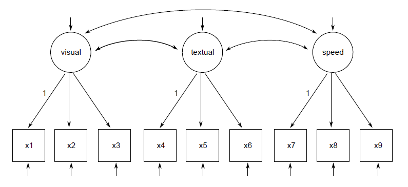
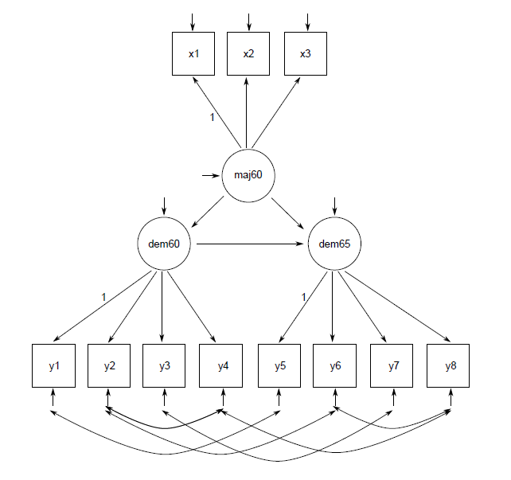
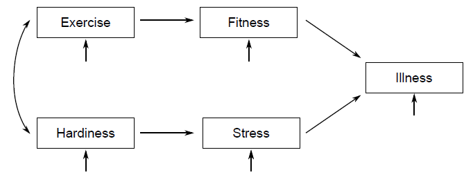

```{r, echo = F}
HolzingerSwineford1939 <- read.csv2("KMKT/7praktikum/HolzingerSwineford1939.csv")
suur.viisik <- read.csv2("KMKT/7praktikum/suur.viisik.csv")
illness.cov <- read.csv2("KMKT/7praktikum/illness.cov.csv")
PoliticalDemocracy <- read.csv2("KMKT/7praktikum/PoliticalDemocracy.csv", sep =",")
```

**Struktuurivõrrandite mudelid** (SEM) on üsna mitmekesine meetodite rühm, mis omab sarnasusi nii faktor- kui regressioonanalüüsiga. Nagu uurivas faktoranalüüsis saame vaadeldud muutujate kaudu defineerida liitmuutujaid ehk faktoreid. Struktuurivõrrandite mudeliste kontekstis nimetatakse neid tüüpiliselt **latentseteks muutujateks**. Aga mudelisse saab lisada veel muid vaadeldud muutujaid (mis ei osale latentsete muutujate defineerimises) ja uurida muutujatevahelisi regressioonseoseid.   
Kinnitav faktoranalüüs on selline struktuurivõrrandite mudel, mis sisaldab ainult latentsete muutujate osa ja milles puuduvad regressioonseosed. Samas saab teha ka sellise mudeli (nn teeanalüüs, ingl k *path analysis*), mis sisaldab ainult vaadeldud muutujaid ja nende vahelisi regressioonseoseid ilma igasuguste latentsete muutujateta. Selles praktikumis kasutame R-i lisamoodulit *lavaan* (nimetus tuleb sõnadest *latent variable analysis*).

```{r, warning= F, message=F, eval = F}
install.packages("lavaan")
```

Kasutame esialgu lavaani mooduliga kaasa tulevat klassikalist näidisandmestikku nimega *HolzingerSwineford1939*, mis sisaldab 7. ja 8. klassi õpilaste kohta üheksat vaimse võimekuse alatesti skoori. Laadime lavaani lisamooduli ja vaatame andmestiku esimesi ridu.

```{r, warning=F, message= F}
library(lavaan)
head(HolzingerSwineford1939)
```

Nagu näha kannavad meid huvitavad muutujad nimesid x1 kuni x9, mis meile kuigi palju ei ütle. Alloleva käsu abil peaks RStudio akna alumises parempoolses osas avanema andmestiku täpsem kirjeldus, milles on ära toodud alatestide sisu.

```{r, eval =F}
help(HolzingerSwineford1939)
```
Selle käsu jooksutamine peaks avama *Help* akna selle andmestiku kirjeldusega. Seal on ära toodud ka muutujate nimed:  
  
- id - Identifier  
- sex - Gender  
- ageyr - Age, year part  
- agemo - Age, month part  
- school - School (Pasteur or Grant-White)   
- grade - Grade  
- x1 - Visual perception  
- x2 - Cubes  
- x3 - Lozenges  
- x4 - Paragraph comprehension  
- x5 - Sentence completion  
- x6 - Word meaning  
- x7 - Speeded addition  
- x8 - Speeded counting of dots  
- x9 - Speeded discrimination straight and curved capitals  

#Näide 1. Kinnitava faktoranalüüsi mudeli rakendamine  
Lavaani mooduli funktsioonidega tutvumiseks teeme alustuseks suhteliselt lihtsa **kinnitava faktoranalüüsi mudeli**, milles üheksa vaadeldud muutuja abil defineerime 3 latentset muutujat (faktorit). Antud juhul on tegemist suhteliselt lihtsa mudeliga, aga tihti võivad mudelid minna üsna keeruliseks. Sellest tulenevalt on reeglina mõistlik enne andmete analüüsimise kallale asumist teha mudelisse kaasatavate muutujate vaheliste seoste kohta skeem (nt paberi peal). Praegusel juhul näeks mudeli diagramm välja järgnev.

<div style="width:400px; height=400px">

</div>


Jooniselt on näha, et vaadeldud muutujad x1-x3 mõõdavad latentset muutujat nimega *visual*, x4-x6 latentset muutujat nimega *textual* ja x7-x9 latentset muutujat nimega *speed*. Vastavalt tavale tähistavad SEM-i diagrammidel nelinurgad **vaadeldud muutujaid** ja ringid või ellipsid **latentseid muutujaid**. Latentsete muutujate vahelised kaared tähistavad nendevahelisi korrelatsioone. Väikesed noolekesed muutujate juures tähistavad dispersioone, mis samuti kuuluvad mudeli poolt välja arvutatavate parameetrite hulka. Vaadeldud muutujate puhul on tegemist jääkdispersiooniga ehk selle osaga muutuja variatiivsusest, mis ei ole määratud latentse faktori poolt. Latentsetele muutujatele on vaja anda ka skaala ja selleks fikseeritakse iga faktori puhul ühe sellele laaduva vaadeldud muutuja laadung. Seda tähistavad number 1-d mõne noole juures.

  
Mudeli diagramm aitab ka hinnata, kas analüüsi kaasatavas andmestikus on piisavalt infot, et arvutada välja kõik need mudeli parameetrid, mida meil vaja läheb. Jooniselt saame kokku lugeda, et meil on vaja hinnata 6 faktorlaadungit (9 vaadeldavat muutujat miinus need 3, mille laadungid on fikseeritud), 3 korrelatsiooni ja 12 dispersiooni. See teeb kokku 21 parameetrit. Maksimaalne parameetrite arv sõltub mudelisse kaasatavate vaadeldud muutujate arvust ja seda saab arvutada valemi p(p+1)/2 abil, milles "p" on mudelisse kaasatavate vaadeldud muutujate arv. Praegusel juhul anname mudelile ette 9 muutujat ja  sellest tulenevalt maksimaalne vabade parameetrite arv mudelis oleks $9(9+1)/2=45$. Järelikult pole antud juhul meil probleemi sellega, et tahaksime mudelil lasta hinnata liiga suurt arvu vabu parameetreid. 

SEM eeldab ka, et analüüsi kaasatavad muutujad oleksid normaaljaotusega ja et nad ei oleks liiga tugevalt seotud (ühte meetodi multikollineaarsuse kindlakstegemiseks vaatasime eelmises praktikumis). Lisaks sellele võib SEM-i puhul probleeme tekitada see, kui analüüsi kaasatavad muutujad on väga erinevatel numbrilistel skaaladel (nt mõned muutujad ühekohalised komakohtadega arvud ja teised kolmekohalised arvud). Erinevalt uurivast faktoranalüüsist, mis teostab arvutusi standardiseeritud korrelatsioonikordajate peal, kasutab SEM kovariatsioonikordajaid, mis sisaldavad infot ka muutujate skaala kohta. Väga erinevate suurusjärkude korral tasub korrutada või jagada mõned muutujad mingi koefitsiendiga, et kõik muutujad oleksid enam-vähem sarnastes suurusjärkudes. ühe- ja kolmekohaliste arvudest koosnevate muutujate näite puhul saab ühekohalised muutujad korrutada läbi 100-ga.

#Mudeli kirjeldamine
Järgnevalt peaksime mudeli viima R-ile ja lavaanile arusaadavale kujule. Võimalik, et teil on varasemast praktikumist meeles, kuidas käis mudelite kirjeldamine lineaarsete mudelite puhul funktsioonis *lm*. Lavaani mudeli kirjeldamise süntaks on sellele üsna sarnane.  

**1.** regressioonseose tähistus  
$sõltuv muutuja \sim sõltumatu.muutuja$
 
**2.** Latentse muutuja defineerimine (kus x1, x2 ja x3 on latentsele tunnusele laaduvad vaadeldud muutujad):   

$latentne.muutuja =\sim x1 + x2 + x3$

**3.** Muutujate-vahelise korrelatsiooni saame mudelisse kahekordse tilde abil: 
   
$muutuja1 \sim \sim  muutuja2$

Neid kolme tüüpi seoseid läheb mudelite kirjeldamisel kõige sagedamini vaja. Antud juhul näeks meie 3-faktoriline mudel välja järgnev:

```{r}
mudel1 <- "
visual =~ x1 + x2 + x3
textual =~ x4 + x5 + x6
speed =~ x7 + x8 + x9"
```

Mudeli kirjeldus peab paiknema jutumärkide (või ülakomade) vahel ja iga mudeli valem omaette real. Pikemate mudelite korral on vahel selguse huvides kasulik mudelit liigendada, jättes valemite vahele tühje ridu või kommentaare. Nagu mujalgi R-i koodis on kommentaarid "#" sümboliga algavad read.

#Mudeli väljund
Olles mudeli ära kirjeldanud saame sobitada mudeli oma andmetele kasutades funktsiooni *cfa* (nagu *confirmatory factor analysis*), millele anname ette mudeli kirjelduse ja argumendi *data* abil tabeli nime, millest vastavaid muutujaid otsida.

```{r}
fit1 <- cfa(mudel1, data=HolzingerSwineford1939)
```

Seejärel saame funktsiooni *summary* abil uurida mudeli väljundit. Lavaani mudelite puhul tasub enamasti funktsiooile *summary* anda veel 2 argumenti: *fit.measures=TRUE* annab meile lisaks hii-ruudule veel täiendavaid mudeli sobitusastme näitajaid, ning *standardized=TRUE* annab lisaks standardiseerimata mudeli koefitsientidele meile need ka standardiseeritud kujul. (Reeglina huvitavadki meid rohkem standardiseeritud kordajad.)

```{r}
summary(fit1, fit.measures=TRUE, standardized=TRUE)
```

Mudeli väljundi ülaosas on näha valimi suurus ning hii-ruut-statistik (*Minimum Function Test Statistic*) koos vabadusastmete arvu ja p-väärtusega. Hii-ruut testib antud juhul nn täpse sobitumise hüpoteesi, mille kohaselt ei erine mudeli põhjal arvutatud kovaritasioonimaatriks andmestiku põhjal arvutatud kovariatsioonimaatriksist. **Me tahame, et hii-ruut oleks võimalikult väike ja p-väärtus võimalikult suur.** Kui me tüüpiliselt tahame, et p-väärtus oleks alla 0.05-e, siis praegu tahame, et see oleks 0.05-st suurem. Hii-ruudu puhul tuuakse sageli välja, et see on tundlik valimi suuruse suhtes: suurte valimite korral kipub p-väärtus isegi heade mudelite korral jääma < 0.05. Arvamused lähevad lahku, kui suurt valimit lugeda antud juhul suureks: mõnede arvates esineb seda probleemi alles tuhandetesse küündivate valimite puhul, teiste arvates võib see hakkata rolli mängima kohe kui valimi suurus ületab paarisaja inimese piiri. üsna kindel on aga see, et paarisaja osalejaga valimite puhul see probleemiks olla ei tohiks. Praegusel juhul näitab hii-ruut, et mudel andmetele kuigi hästi ei sobi. 
  
Järgnevalt on ära toodud täiendavad sobitusastme näitajad, mida me funktsioonilt *summary* tellisime argumendi *fit.measures abil*. Sobitusastme näitajad võib laias laastus jagada kahte rühma: lisanduva sobitusastme indeksid (*incrementalt indices*) ja absoluutse sobitusastme indeksid (*absolute fit indices*). Esimesed mõõdavad sobitusastme paranemist võrreldes sellise mudeliga, milles vaadeldud muutujate vahelised korrelatsioonid puuduvad. Teised mõõdavad, kui hästi suudab meie poolt koostatud mudel taastada tegelike andmete põhjal arvutatud kovariatsioonimaatriksi. Lisanduva sobitusastme indeksistest on väljundis toodud TLI (*Tucker-Lewis index*) ja CFI (*comparative fit index*). Nende puhul näitavad mudelis head sobitusastet väärtused 0.95 ja üles. Absoluutse sobitusastme indeksitest on ära toodud RMSEA (*root mean square error of approximation*) ja SRMR (*standardized root mean square residual*), mille puhul head sobitusastet näitavad väärtused 0.05 ja alla. RMSEA puhul on ära toodud ka 90\% usalduspiirid. Hea mudeli korral oleks alumine piir alla 0.05 ja ülemine mitte üle 0.10. Ka kõigi nende näitajate põhjal võime öelda, et sellisel kujul antud mudel andmetega ei sobi.

Sobitusastme indeksite järel tuleb viimasena tabel mudeli parameetrite hinnangutega. Tabelis on kõigepealt toodud fakorlaadungid (alajaotus *Latent variables*), seejärel faktorite vahelised seosed (alajaotus *Covariance*) ja dispersioonid (*Variances*). Standardiseerimata parameetrid on tulbas nimega *Estimates* ja standardiseeritud parameetrid tulbas nimega *Std.all*. Lisaks sellele on tabelis toodud ka standardvead (*Std.err*), z-väärtused (mis on standardiseerimata parameeter jagatuna st.veaga) ning p-väärtused. (Tulbas *Std.lv* on parameetrite väärtused, siis kui standardiseerida ainult latentsed muutujad).

Nagu näha on muutujate x1, x4 ja x7 standardiseerimata laadung 1.000 ja mõned näitajad on neist ridadest puudu. See tuleb sellest, struktuurivõrrandite mudelite puhul tuleb latentsele muutjale anda skaala. Kõige sagedamini kasutatav võimalus selleks on anda mõne laaduva vaadeldud muutuja skaala fikseerides selle sandardiseerimata laadungi 1-ga. Lavaan on seda automaatselt teinud, fikseerides iga latentse muutuja puhul esimese indikaatori standardiseerimata laadungi. Kuidas parameetreid tõlgendada? Standardiseerimata laadungid on tõlgendatavad regressioonikoefitsientidena. Kui muutuja x2 standardiseerimata laadung faktorile visual on 0.554 siis võib faktori väärtuse 1-punktilise suurenemise korral oodata, et x2 suureneb 0.554 punkti võrra.

Ainult ühele faktorile laaduvate vaadeldud muutujate puhul võib standardiseeritud laadungeid tõlgendada faktori ja muutuja vahelise korrelatsioonikordajana. Nagu korrelatsioonikordaja puhul ikka saame seda ruutu võttes kindlaks teha kui suure osa tunnuse variatiivsusest seos ära määrab. Tunnuse x2 puhul on korrelatsioon faktoriga visual 0.424 ja faktor määrab ära 0.42422=0.179 ehk umbes 18 protsenti tunnuse x2 variatiivsusest. Muutujate puhul, mis laaduvad rohkem kui ühele faktorile (praeguses mudelis meil selliseid pole) ei saa standardiseeritud laadungeid tõlgendada korrelatsioonikordajatena vaid standardiseeritud regressioonikordajatena, mille puhul hoitakse korreleeritud faktoreid kontrolli all. Neid ruutu võttes ei saa kindlaks teha seletatava variatiivsuse osakaalu.   

Alajaotuses *Covariances* olevad standardiseerimata parameetrid kujutavad endas faktorite vahelisi kovariatsioonikordjaid ja standardiseeritud parameetrid korrelatsioonikordajaid. Antud mudeli puhul võib näiteks näha et faktori visual korrelatsioon faktoriga textual on 0.459 ja faktoriga speed 0.471. Vaadeldud muutujate puhul näitavad dispersioonid (*Variances*) standardiseeritud kujul seda osa tunnuse variatiivsusest, mida faktor ei seleta. Nt tunnuse x2 puhul ei suuda faktor visual seletada tervelt 82.1 protsenti variatiivsusest. 
  
    
Parameetrite tabeli puhul tasub ka kontrollida, et ei esineks negatiivseid jääkdispersioone ja standardiseeritud parameetreid absoluutväärtusega > 1. Selliseid väärtusi ei ole võimalik tõlgendada ja nende esinemine annab märku probleemidest mudeli või andmetega (nt liiga väike valim või liiga tugevalt korreleeritud muutujad).  
Mudeli väljundit saab tellida ka osade kaupa. Seda võib vaja minna näiteks siis kui soovime teada saada mõnda sellist sobitusastme näitjat, mida funktsioon *summary* välja ei trükkinud. Nt üks suhteliselt sageli raporteeritav sobitusastme näitaja on GFI (*goodness of fit index*, hea väärtus 0.95 ja üles). Selle ja suure hulga muid sobitusindekseid saame kätte funktsiooni *fitMeasures* abil:

```{r, eval = F}
fitMeasures(fit1)
```


Aga eraldi saab tellida ka standardiseerimata parameetrite hinnanguid...

```{r, eval = F}
parameterEstimates(fit1)
```

... ja standardiseeritud hinnanguid.

```{r, eval = F}
standardizedSolution(fit1)
```

Kui mudel andmetega ei sobi, siis üks võimalus probleeme diagnoosida, on vaadata mudeli jääkide maatriksit. Jäägid kujutavad endast erinevusi tegelike andmete põhjal arvutatud ja mudeli põhjal taastatud kovariatsioonikordajate vahel. Jääke, mida struktuurivõrrandite mudelite puhul uurida saab, on erinevat tüüpi. Vaatame selliseid, mida nimetatakse **korrelatsioonijääkideks** (ehk siis kovariatsioonikordajad arvutatakse ümber korrelatsioonideks, mida on lihtsam tõlgendada). Korrelatsioonijäägid saame funktsiooni *residuals* abil, määrates argumendi *type* väärtuseks "cor". Tabelist peaksime üles otsima jääkkorrelatsioonid absoluutväärtusega > 0.10. Need nii-öelda suured jäägid näitavad meile, milliste muutujate vaheliste seoste seletamisega mudel väga hästi hakkama ei saa.

```{r}
residuals(fit1, type="cor")
```

Antud juhul näeme, et muutuja x3 omab suurt jääkkorrelatsiooni muutujaga x5, muutuja x7 muutujatega x1 ja x2 ning muutuja x9 muutujatega x1 ja x3. Kui muutuja omab suuri jääk korrelatsioone mõnele teisele faktorile laaduvate muutujatega, on võimalik, et muutuja mõõdab rohkem kui ühte konstrukti ja tal tuleks lubada laaduda rohkem kui ühele faktorile. Teine võimalus on, et muutujate vahelisi seoseid seoseid ei põhjusta mitte ainult mudeli faktor(id), vaid ka mingi muu tegur (me ei pruugi isegi teada mis täpselt). Sellise võimaluse arvesse võtmiseks saab mudelis määrata mõnede muutujate jääkdispersioonid omavahel korreleeruma. Teeme proovi mõttes uue mudeli, milles määrame ka muutujatevahelised korrelatsioonid, mida faktorid ei seleta.


```{r}
mudel2 <- "
# latentsed muutujad
visual =~ x1 + x2 + x3
textual =~ x4 + x5 + x6
speed =~ x7 + x8 + x9
# jääkdispersioonide vahelised korrelatsioonid
x7 ~~ x1 + x2
x9 ~~ x1 + x3
x3 ~~ x5"
```


Vaadake selle mudeli väljundit. Kas sobitusastme indeksid läksid paremaks või mitte?
```{r}
fit2 <- cfa(mudel2, data=HolzingerSwineford1939)
summary(fit2, fit.measures=TRUE, standardized=TRUE)
```

# Parameetrite hindamise (arvutamise) meetoditest
Funktsiooni *cfa* vaikemeetodiks on ML(*maximum likelyhood*). ML arvutusmeetodi eeldusteks on: tunnuste mitmemõõtmeline normaaljaotus (iga komponentidelineaarkombinatsioon on normaaljaotusega), tunnused vähemalt intervall skaalal.

ML-i analoog on GLS (*generalized least squares*), mis on arvutuslikult lihtsam, headuse näitajad tulevad samad, eriti kui n on suur. ML ja GLS sobivad ainult mitmemõõtmelise normaaljaotuse korral, või juhtudel, kui kõrvalekalded on suhteliselt väikesed. 

Mittenormaaljaotuslike andmete korral kaks enim kasutatavat parameetrite arvutamise meetodit: RML(*Robust ML*) ja WLS (*weighted least squares*) ei ole soovitatav väga suurte valimite korral. Eelistada pigem just väikeste valimite korral(vt. leongu konspekti).

Me saame muuta meetodi valikut argumendiga *estimator*:

```{r}
fit2 <- cfa(mudel1, data=HolzingerSwineford1939, estimator = "GLS")
fit3 <- cfa(mudel1, data=HolzingerSwineford1939, estimator = "WLS")
```


#Näide 2: regressiooniseostega mudeli rakendamine
Proovime teha ka sellist mudelit, mis sisaldab lisaks latentsetele muutujatele ka regressioonseoseid. Selleks vaatame teist lavaaniga kaasa tulevat näidisandmestikku nimega *PoliticalDemocracy*. See tabel sisaldab 75 riigi kohta 11 poliitilist ja majanduslikku arengut puudutavat näitajat. Muutujad y1 kuni y4 on vastavalt ajakirjandusvabaduse tase, vaba politilise opositsiooni olemasolu, vabade valimiste toimumine ja valitud parlamendi efektiivsus mõõdetuna aastal 1960. Muutujad y5 kuni y8 on samad näitajad mõõdetuna aastal 1965. Muutujad x1 kuni x3 on vastavalt riigi sisemajanduse koguprodukt, energiatarbimine elaniku kohta ja tööstussektoris töötava tööjõu osakaal mõõdetuna aastal 1960. Andmestiku tutvustus avaneb alljärgneva käsuga:

```{r, eval = F}
help(PoliticalDemocracy)
```

Üritame andmetele sobitada alljärgneval joonisel kujutatud mudelit. Defineerime kolm latentset muutujat. 
Tunnused x1 kuni x3 mõõdavad latentset muutujat *maj60* (st majanduslik arengutase aastal 1960), tunnused *y1* kuni *y4* mõõdavad latentset muutujat *dem60* (st demokraatia aastal 1960) ning tunnused *y5* kuni *y8* mõõdavat latentset muutujat *dem65* (st demokraatia aastal 1965). Latentsete muutujate vahel on regressioonseosed. Demokraatiat aastal 1960 mõjutab majanduse arengutase aastal 1960. Demokraatiat aastal 1965 mõjutavad nii majandus kui demokraatia aastal 1960. Latentsed muutujad ei suuda antud juhul seletada kõiki demokraatia indikaatorite vahelisi seoseid. Seetõttu on mudelisse lisatud ka nende jääkdispersioonide vahelised korrelatsioonid. Muutuja *y1* korreleerub *y5*-ga, *y2* korreleerub *y4*-ga ja *y6*-ga, *y3* korreleerub *y7*-ga, *y8* korreleerub *y4*-ga ja *y6*-ga. Mudelisse lisatud 11 vaadeldud muutujat võimaldavad hinnata $11(11+1)/2 = 66$ vaba parameetrit. Meil on vaja hinnata 31 parameetrit: 8 faktorlaadungit, 14 dispersiooni, 3 regressiooni- ja 6 korrelatsioonikordajat. (Nagu esimese näite puhul fikseeritakse ka praegu iga latentse muutuja puhul esimese indikaatori standardiseerimata laadung, selleks et omistada latentsele muutujale skaala. Seetõttu ei olegi meil vaja hinnata 11 vaid ainult 8 faktorlaadungit). Järelikult infot on piisavalt. Lavaanis näeks selline mudel välja järgnevalt:


<div style="width:400px; height=400px">

</div>

```{r}
mudel3 <- "
# defineerime latentsed tunnused
maj60 =~ x1 + x2 + x3
dem60 =~ y1 + y2 + y3 + y4
dem65 =~ y5 + y6 + y7 + y8

# regressioonseosed latentsete tunnuste vahel
dem60 ~ maj60
dem65 ~ maj60 + dem60
# jääkdispersioonide vahelised korrelatsioonid
y1 ~~ y5
y2 ~~ y4 + y6
y3 ~~ y7
y4 ~~ y8
y6 ~~ y8"
```

Sobitame mudeli andmetele ja uurime väljundit. Kuna mudel sisaldab ka regressioonseoseid, siis kasutame sobitamiseks funktsiooni sem. Kas mudel sobib andmetega?

```{r}
fit3 <- sem(mudel3, data=PoliticalDemocracy)
summary(fit3, fit.measures=TRUE, standardized=TRUE)
```


#Modifikatsiooniindeksid
Modifikatsiooniindeksid näitavad, kui palju väheneks mudeli hii-ruut statistik mingi vaba parameetri mudelisse lisamisel. (Mida väiksem hiiruut, seda paremini mudel andmetega sobib.) Hoiatusena tuleks märkida, et indeksite puhul on tegemist umbkaudsete oletustega. Statistikaprogramm ei proovi kõigi nende parameetrite mudelisse lisamist ka tegelikult läbi, vaid kasutab nende hindamiseks mingit suhteliselt jämedat rusikareeglit.

Defineerime sama 3-faktorilise mudeli:

```{r}
HS.model <- "visual =~ x1 + x2 + x3
textual =~ x4 + x5 + x6
speed =~ x7 + x8 + x9"
```


Sobitame mudeli andmetele ja vaatame mudeli väljundit.

```{r}
fit1 <- cfa(HS.model, data=HolzingerSwineford1939)
summary(fit1, fit.measures=TRUE)
```


Nagu näha, ei sobi mudel andmetega väga hästi. Hii-ruudu p-väärtus on alla 0.05-e, TLI ja CFI on alla 0.95-e ning RMSEA ja SRMR on üle 0.05-e. Järgnevalt vaatame mudeli modifikatsiooniindeksite tabelit ja otsime sellest üles kõige suurema indeksiga parameetri.

```{r}
modindices(fit1)
```

**Modifikatsiooniindeksite** tabelis näitavad 3 esimest tulpa lavaani mudeli defineerimise tähistust kasutades, millise parameetri kohta indeks käib.  
**Tulbas lhs** (sõnadest left hand side) on parameetri kohta käiva valemi vasakpoolne muutuja ja tulbas rhs (*right hand side*) on sama valemi parempoolne muutuja.   
**Tulp op** (operator) näitab meile, millist tüüpi seosega on tegu: =$\sim$ on latentsele muutujale laadumine ning $\sim$ $\sim$ puhul on tegemist muutujatevahelise korrelatsiooniga.   
Parameetri modifikatsiooniindeksi väärtus on toodud **tulbas mi**. Antud juhul puudutavad tabeli 24 esimest rida seoseid, mis on mudelis juba vabade parameetritena olemas ja pole seetõttu väga huvitavad. Aga 25. real olev visual =$\sim$ x4 ja tulbas mi olev väärtus 1.211 tähendavad seda, et kui me lubaksime muutujal x4 laaduda ka faktorile *visual*, võiksime oodata, et mudeli hii-ruut väheneb umbes 1.2 võrra.   
Lisaks modifikatsiooniindeksile arvutatakse välja ka **parameetri oodatav väärtus** (tulp epc, *expected parameter change*) ja selle standardiseeritud väärtus (meid huvitab eelkõige tulp sepc.all). Mudelisse tasub vabade parameetritena lisade eelkõige neid, mille puhul on suured nii *mi* kui *epc* väärtused. Modifikatsiooniindeksite puhul loetakse statistiliselt oluliseks väärtusi üle 3.84. Väiksema indeksi väärtusega parameetrite mudelisse lisamine üldiselt ära ei tasu. Indeksid ei ole üksteisest sõltumatud. See tähendab, et kui tabelis on mitu olulist indeksit, siis ei saa me neid korraga mudelisse lisada ja oodata, et hii-ruut kahaneb nende indeksite summa võrra. Kui me seda teeksime, võivad erinevused oodatavate ja tegelike muutuste vahel olla väga suured. Seega tuleks indeksite poolt soovitatavaid parameetreid mudelisse lisada ühekaupa. Otsime tabelist üles kõige suurema modifikatsiooniindeksiga parameetri ja lisame selle mudelisse. Praegusel juhul on kõige suurema indeksiga parameeter 30. real, mis ütleb, et kui lubaksime muutujal x9 laaduda ka faktorile visual võiks oodata et hii-ruut kahaneb umbes 36 võrra. Teeme uue mudeli, milles see muutus on sisse viidud, sobitame andmetele ja vaatame väljundit.

```{r}
HS.model2 <- "visual =~ x1 + x2 + x3 + x9
textual =~ x4 + x5 + x6
speed =~ x7 + x8 + x9"
fit2 <- cfa(HS.model2, data=HolzingerSwineford1939)
summary(fit2, fit.measures=TRUE)
```

Selle mudeli sobitusastme näitajad on läinud natuke paremaks. CFI ja SRMR on isegi ületanud selle väärtuse piiri, mida võib pidada heaks, teised näitajad aga mitte. Nüüd vaatame selle uue mudeli modifikatsiooniindekseid ja otsime sealt üles kõige suurema indeksiga parameetri.

```{r}
modindices(fit2)
```


Kõige suurem mi väärtus on real 60, mis ütleb, et lisades mudelisse muutujate *x3* ja *x5* jääkdispersioonide vahelise korrelatsiooni, võiksime oodata hii-ruudu kahanemist umbes 8.6-e võrra. Lisame jälle uue parameetri mudelisse, sobitame mudeli andmetele ja uurime väljundit.

```{r}
HS.model3 <- "visual =~ x1 + x2 + x3 + x9
textual =~ x4 + x5 + x6
speed =~ x7 + x8 + x9
x3 ~~ x5"
fit3 <- cfa(HS.model3, data=HolzingerSwineford1939)
summary(fit3, fit.measures=TRUE)
```

Sobitusastmenäitajad on läinud veel natuke paremaks. Nüüd on ka TLI üle 0.95-e, kuid hii-ruut ja RMSEA veel väga head sobivust ei näita. Uurime jällegi uue mudeli modifiktatsiooniindekseid ja otsime üles suurima.

```{r}
modindices(fit3)
```

Suurim väärtus tulbas *mi* on real 71, mis ütleb, et et lisades mudelisse muutujate *x4* ja *x7* jääkdispersioonide vahelise korrelatsiooni, võiksime oodata hii-ruudu kahanemist umbes 8 võrra. Lisame taas uue parameetri mudelisse, sobitame mudeli andmetele ja uurime väljundit.

```{r}
HS.model4 <- "visual =~ x1 + x2 + x3 + x9
textual =~ x4 + x5 + x6
speed =~ x7 + x8 + x9
x3 ~~ x5
x4 ~~ x7"
fit4 <- cfa(HS.model4, data=HolzingerSwineford1939)
summary(fit4, fit.measures=TRUE)
```


Sobitusastme näitajad on jällegi natuke paranenud. Nüüd on ka RMSEA alla 0.05, kuid hii-ruut pole jätkuvalt veel head taset saavutanud. Põhimõtteliselt võiksime parameetrite lisamise protsessi samal viisil jätkata. Selle kohta, kas parameetrite lisamine muutis sobitusastet oluliselt paremaks, saame arvutada ka p-väärtuse. Seda saame teha funktsiooni anova abil, millele anname ette mudelid, mida omavahel võrrelda soovime. Seda funktsiooni saame aga kasutada ainult hierarhiliste mudelite võrdlemiseks. Hierarhilised on mudelid siis, kui üks mudel sisaldub teises ja me saame ühe teisest tuletada vabade parameetrite lisamise teel.

```{r}
anova(fit3, fit4)
```


Antud juhul näeme tabeli kõige parempoolsemast tulbast, et p-väärtus on hästi väike (0.004 ehk <0.01), mis tähendab, et neljas mudel on oluliselt kolmandast parem. Mudelite indeksite alusel modifitseerimisele tuleks üldiselt läheneda väga ettevaatlikult. Mudeli märkimisväärse muutmisega kaasneb oht, et me ülesobitame mudeli just sellele konkreetsele andmestikule ja leitud mudelit ei ole hiljem võimalik üldistada teistele valimitele. Igal valimi juures on mõningad omapärasused ja kui me oma mudelit mingi valimi andmete põhjal muudame, on oht, et muutused kajastavad just neid omapärasusi ning mitte üldiselt esinevaid seoseid meid huvitavate muutujate vahel.


# Ülesanded


1. Andmefailis "suur.viisik" on 30 Suure Viisiku kitsama alaomaduse skoori ehk iga isiksuseomaduse kohta 6 alaomadust. Tehke selle andmestiku kohta 5-faktoriline kinnitava faktoranalüüusi mudel, nii nagu Suure Viisiku teooria seda ette näeb. Hinnake sellise mudeli sobivust antud andmetele. Mudeli koostamiseks on vaja teda tabelis olevate muutujate nimesid. Need saab katte funktsiooni names abil.
```{r}
names(suur.viisik)
```

Uurige ka mudeli parameetrite tabelit. Vaadake iga faktori puhul, millised vaadeldud muutujatest laaduvad faktorile kõige tugevamalt ja millised kõige nõrgemalt? Millised faktorid on omavahel kõige tugevamalt ja millised kõige nõrgemalt korreleeritud? Uurige jääkdispersioonide abil, milliseid vaadeldud muutujad seletab antud mudel kõige halvemini?
```{r}
mudelBig5 <- "
# defineerime latentsed tunnused
neurootilisus =~ N1 + N2 + N3 + N4 + N5 + N6
ekstravertsus =~ E1 + E2 + E3 + E4 + E5 + E6
avatus =~ O1 + O2 + O3 + O4 + O5 + O6
sotsiaalsus =~ A1 + A2 + A3 + A4 + A5 + A6
meelekindlus =~ C1 + C2 + C3 + C4 + C5 + C6 "
fitBig5 <- cfa(mudelBig5, data=suur.viisik)
summary(fitBig5)
```

2. Teine ülesanne on laenatud Rex Kline'i raamatust Principles and *Practice of Structural Equation Modeling* ja kasutatavad andmed parinevad algselt uurimusest, mille autoriteks on Roth jt (1989). Maatriks nimega *illness.cov* sisaldab 5 muutuja vahelisi kovariatsioonikordajaid. Muutujad vastavad
viie küsimustiku skoorile ja nende sisu on järgmine:
  
2.1 *exercise* - kui palju vastaja spordiga tegeleb;  
2.2 *fitness* - kui heaks hindab vastaja oma füüsilist vormi;  
2.3 *hardiness* - milliseks hindab vastaja oma vaimset sitkust;  
2.4 *stress* - milliseks hindab vastaja oma stressitaset viimase kuu jooksul;  
2.5 *illness* - mil määral on vastajal viimasel ajal esinenud erinevate haiguste füüsilisi sümptome;  


Struktuurvõrrandite mudeli koostamiseks võib toorandmete asemel kasutada ka kovariatsioonimaatriksit.  Maatriksi põhjal mudeli sobitamise koodirida on koodifailis juba olemas. Teie ülesandeks  on koostada selle ette alloleva joonise põhjal mudeli kirjeldus. Kas antud mudel sobib andmetega?

<div style="width:400px; height=400px">

</div>

Kas kõik mudelis esinevad seosed on statistiliselt olulised? Lisage mudelisse täiendav regressioonseos, milles sõltumatuks muutujaks on *fitness* ja sõltuvaks muutujaks *stress*. Mis juhtub mudeli sobitusastmega?
 
 
```{r, eval = F}
illness.cov <- read.csv("illness.cov.csv", header = TRUE, sep = ";",row.names=1, stringsAsFactors = FALSE)
mudel5 <- "
# regressioonseosed latentsete tunnuste vahel
exercise ~ hardiness
fitness ~ exercise + stress
illness ~ fitness + stress
stress ~ fitness + hardiness
# jääkdispersioonide vahelised korrelatsioonid
hardiness ~~ exercise
"

# Kuna praegu tugineb analüüs kovariatsioonimaatriksile, mitte toorandmetele
# ja sellisel juhul kasutab mudeli sobitamise käsk natuke teisi argumente, 
# siis on sobitamine siin praegu ära tehtud
fit5 <- sem(mudel5, sample.cov=illness.cov, sample.nobs=373, fixed.x=FALSE)
summary(fit5)
```
